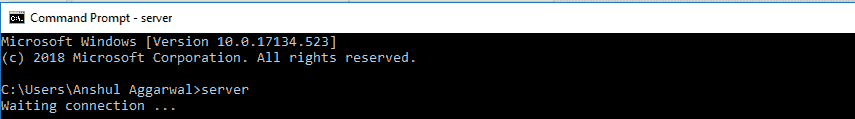
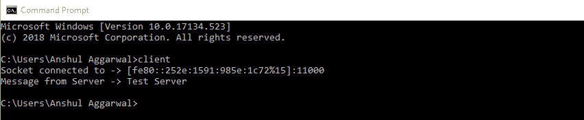
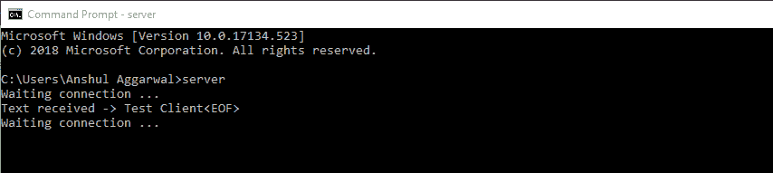
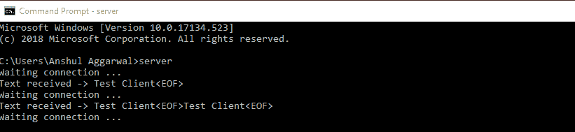

# c#中的套接字编程

> 原文:[https://www . geesforgeks . org/socket-programming-in-c-sharp/](https://www.geeksforgeeks.org/socket-programming-in-c-sharp/)

套接字编程是连接网络上两个节点相互通信的一种方式。基本上，这是一个单向的客户机和服务器设置，客户机连接，向服务器发送消息，服务器使用套接字连接显示消息。一个套接字(节点)监听某个 IP 的特定端口，而另一个套接字则与另一个套接字建立连接。当客户端连接到服务器时，服务器形成侦听器套接字。在深入研究服务器和客户端代码之前，强烈建议先通过 [**TCP/IP 模型**](https://www.geeksforgeeks.org/computer-network-tcpip-model/) 。

**Client Side Programming**

在创建客户端套接字之前，用户必须决定他要连接到哪个“ *IP 地址*，在这种情况下，是*本地主机*。同时，我们还需要属于插座本身的“*家族*”方法。然后，通过**连接**的方法，我们将套接字连接到服务器。在发送任何消息之前，必须将其转换为字节数组。然后也只有这样，才能通过 ***发送*** 的方法发送到服务器。后来，多亏了 ***接收*** 的方法，我们将得到一个字节数组作为服务器的答案。值得注意的是，就像在 C 语言中一样，“发送”和“接收”方法仍然返回发送或接收的字节数。

## C#

```cs
// A C# program for Client
using System;
using System.Net;
using System.Net.Sockets;
using System.Text;

namespace Client {

class Program {

// Main Method
static void Main(string[] args)
{
    ExecuteClient();
}

// ExecuteClient() Method
static void ExecuteClient()
{

    try {

        // Establish the remote endpoint
        // for the socket. This example
        // uses port 11111 on the local
        // computer.
        IPHostEntry ipHost = Dns.GetHostEntry(Dns.GetHostName());
        IPAddress ipAddr = ipHost.AddressList[0];
        IPEndPoint localEndPoint = new IPEndPoint(ipAddr, 11111);

        // Creation TCP/IP Socket using
        // Socket Class Constructor
        Socket sender = new Socket(ipAddr.AddressFamily,
                   SocketType.Stream, ProtocolType.Tcp);

        try {

            // Connect Socket to the remote
            // endpoint using method Connect()
            sender.Connect(localEndPoint);

            // We print EndPoint information
            // that we are connected
            Console.WriteLine("Socket connected to -> {0} ",
                          sender.RemoteEndPoint.ToString());

            // Creation of message that
            // we will send to Server
            byte[] messageSent = Encoding.ASCII.GetBytes("Test Client<EOF>");
            int byteSent = sender.Send(messageSent);

            // Data buffer
            byte[] messageReceived = new byte[1024];

            // We receive the message using
            // the method Receive(). This
            // method returns number of bytes
            // received, that we'll use to
            // convert them to string
            int byteRecv = sender.Receive(messageReceived);
            Console.WriteLine("Message from Server -> {0}",
                  Encoding.ASCII.GetString(messageReceived,
                                             0, byteRecv));

            // Close Socket using
            // the method Close()
            sender.Shutdown(SocketShutdown.Both);
            sender.Close();
        }

        // Manage of Socket's Exceptions
        catch (ArgumentNullException ane) {

            Console.WriteLine("ArgumentNullException : {0}", ane.ToString());
        }

        catch (SocketException se) {

            Console.WriteLine("SocketException : {0}", se.ToString());
        }

        catch (Exception e) {
            Console.WriteLine("Unexpected exception : {0}", e.ToString());
        }
    }

    catch (Exception e) {

        Console.WriteLine(e.ToString());
    }
}
}
}
```

**Server Side Programming**

同样，我们需要一个“IP 地址”来识别服务器，以便让客户端进行连接。创建套接字后，我们调用将 IP 绑定到套接字的“**”方法。然后，调用 ***听*** 的‘法’。该操作负责创建等待队列，该队列将与每个打开的“*套接字*相关联。“ ***listen*** 方法将可以留在等待队列中的客户端的最大数量作为输入。如上所述，通过*发送*和*接收*的方法与客户端进行通信。**

****注意:**别忘了转换成字节数组。**

## **C#**

```cs
// A C# Program for Server
using System;
using System.Net;
using System.Net.Sockets;
using System.Text;

namespace Server {

class Program {

// Main Method
static void Main(string[] args)
{
    ExecuteServer();
}

public static void ExecuteServer()
{
    // Establish the local endpoint
    // for the socket. Dns.GetHostName
    // returns the name of the host
    // running the application.
    IPHostEntry ipHost = Dns.GetHostEntry(Dns.GetHostName());
    IPAddress ipAddr = ipHost.AddressList[0];
    IPEndPoint localEndPoint = new IPEndPoint(ipAddr, 11111);

    // Creation TCP/IP Socket using
    // Socket Class Constructor
    Socket listener = new Socket(ipAddr.AddressFamily,
                 SocketType.Stream, ProtocolType.Tcp);

    try {

        // Using Bind() method we associate a
        // network address to the Server Socket
        // All client that will connect to this
        // Server Socket must know this network
        // Address
        listener.Bind(localEndPoint);

        // Using Listen() method we create
        // the Client list that will want
        // to connect to Server
        listener.Listen(10);

        while (true) {

            Console.WriteLine("Waiting connection ... ");

            // Suspend while waiting for
            // incoming connection Using
            // Accept() method the server
            // will accept connection of client
            Socket clientSocket = listener.Accept();

            // Data buffer
            byte[] bytes = new Byte[1024];
            string data = null;

            while (true) {

                int numByte = clientSocket.Receive(bytes);

                data += Encoding.ASCII.GetString(bytes,
                                           0, numByte);

                if (data.IndexOf("<EOF>") > -1)
                    break;
            }

            Console.WriteLine("Text received -> {0} ", data);
            byte[] message = Encoding.ASCII.GetBytes("Test Server");

            // Send a message to Client
            // using Send() method
            clientSocket.Send(message);

            // Close client Socket using the
            // Close() method. After closing,
            // we can use the closed Socket
            // for a new Client Connection
            clientSocket.Shutdown(SocketShutdown.Both);
            clientSocket.Close();
        }
    }

    catch (Exception e) {
        Console.WriteLine(e.ToString());
    }
}
}
}
```

****在终端或命令提示符下运行:****

*   **首先用保存文件。cs 扩展。假设我们将文件保存为 *client.cs* 和 *server.cs* 。**
*   **然后通过执行以下命令编译这两个文件:**

```cs
$ csc client.cs
```

```cs
$ csc server.cs
```

*   **成功编译后，打开两个 cmd 一个用于服务器，另一个用于客户端，首先尝试按如下方式执行服务器**

****

*   **之后，在另一个 cmd 上执行客户端代码，并在服务器端 cmd 上看到以下输出。**

****

*   **现在，只要客户端程序执行，您就可以在服务器上看到更改。**

** **