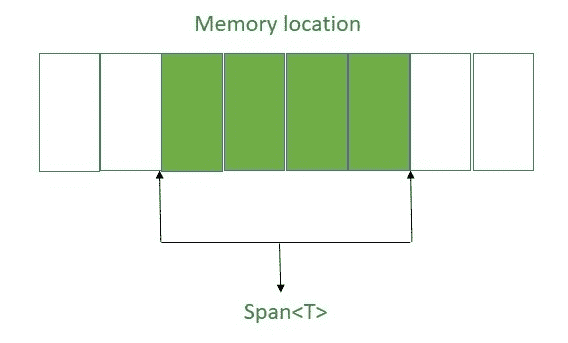
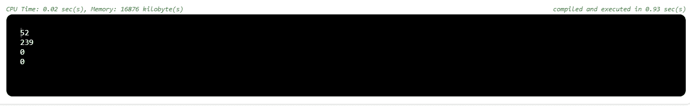

# 跨度<t>。C#中的枚举器结构</t>

> 原文:[https://www . geesforgeks . org/span-enumerator-struct-in-c-sharp/](https://www.geeksforgeeks.org/span-enumerator-struct-in-c-sharp/)

**Span < T >** 是 C# 7.2 引入的新特性，在*中得到支持。NET Core 2.1* 。它提供了对连续内存区域的类型安全访问。该内存可以位于堆、栈上，或者形成一个未分配的内存。Span < T >被定义为一个*参考结构*，这意味着它仅限于在堆栈上分配。*引用结构*设计的主要原因是为了确保在使用 Span < T >时不会导致额外的堆分配。Span < T >提高执行速度，减少现有代码中的内存分配。



这里，Span <t>引用一些已经分配的连续内存(彩色块)。</t>

**跨度< T >。枚举器**结构为**跨度<T>T3】的元素提供枚举器。其中 **Span < T >** 提供了任意内存的连续区域的类型和内存安全表示。**

**语法:**

```
public struct Span<T>.Enumerator
```

**参数:**
这里的参数是 **T** ，其中 **T** 是*Span<T>T8】中的项目类型。*

**示例:**

```
// C# program to demonstrate Span<T>.Enumerator Struct
using System;
using System.Threading.Tasks;

class GFG {

    // a array "arr" type of byte
    private static byte[] arr = new byte[4];

    // main method
    static void Main()
    {
        // ramdomly fillup the array "arr"
        new Random(30).NextBytes(arr);

        // implicitly cast the array
        // "arr" to span<byte>
        Span<byte> sp = arr;

        // Task.Run() method executes
        // the clear() method
        // to clear the array for 
        // each thread operations
        Task.Run(() => clear());

        // call the function "print"
        print(sp);

    }

    public static void clear()
    {
        // delay for 10ms
        Task.Delay(10).Wait();

        lock(arr)
        // defines that one thread 
        // executes one task at one time
        {
            Array.Clear(arr, 0, arr.Length);
        }
    }

    // print function
    public static void print(Span<byte> span)
    {
        foreach(byte e in span)
        {
            Console.WriteLine(e);
            Task.Delay(10).Wait();
        }
    }
}
```

**输出:**

```
52
239
0
0

```



**属性:**

*   *Current:* 用于获取对枚举器当前位置项的引用。

**方法:**

*   *MoveNext():* 它将枚举器前进到跨度的下一项< T >。

**要点:**

*   Span <t>提供对连续内存区域的类型安全访问。</t>
*   不能在*异步方法*内使用。
*   它不实现 *IEnumerator* 或 *IEnumerator < T >* 接口，因为 Span < T >枚举器是一个*引用结构*。
*   它不包括*重置*方法。
*   要使用 *Reset()* 方法，它必须作为接口的一部分来实现。
*   它不包括额外的堆分配。
*   它不能用作泛型类型参数。
*   Span <t>提供对存储器的读写访问。</t>
*   *ReadOnlySpan < T >* 提供对内存的只读访问。