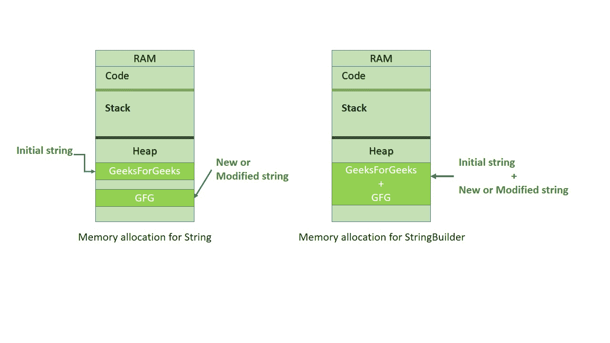

# c#中的 StringBuilder

> 原文:[https://www.geeksforgeeks.org/stringbuilder-in-c-sharp/](https://www.geeksforgeeks.org/stringbuilder-in-c-sharp/)

C# **StringBuilder** 类似于 [Java StringBuilder](https://www.geeksforgeeks.org/stringbuilder-class-in-java-with-examples/) 。一个*字符串*对象是不可变的，即一个字符串一旦创建就不能改变。每次使用**系统的任何方法时。字符串**类，然后在内存中创建新的**字符串对象**。例如，字符串“geesforgeks”占用堆中的内存，现在，通过将初始字符串“*geesforgeks*”更改为“ *GFG* ”将在内存堆上创建一个新的字符串对象，而不是在相同的内存位置修改初始字符串。在需要对字符串进行重复修改的情况下，我们需要 *StringBuilder* 类。为了避免在初始字符串 C#中替换、追加、移除或插入新字符串，引入 **StringBuilder** 概念。StringBuilder 是一个**动态对象**。它不会在内存中创建新的对象，而是动态扩展所需的内存，以容纳修改后的或新的字符串。



#### 字符串生成器的声明和初始化

StringBuilder 可以像类一样声明和初始化，

```cs
StringBuilder s = new StringBuilder();

or

StringBuilder s = new StringBuilder("GeeksforGeeks");

```

**“s”**是 **StringBuilder** 类的对象。此外，我们可以将一个字符串值(这里是“GeeksforGeeks”)作为参数传递给 StringBuilder 的构造函数。

#### 定义字符串生成器的容量

虽然**字符串生成器**是一个动态对象，允许您扩展它封装的字符串中的字符数，但是您可以为它可以容纳的最大字符数指定一个值。这个值叫做 **StringBuilder** 对象的容量。

```cs
StringBuilder s = new StringBuilder(20);

or

StringBuilder s = new StringBuilder("GeeksForGeeks", 20);

```

在这里，

*   在第一条语句中，我们将一个整数值作为参数传递给构造函数。这是可以容纳字符串的最大字符容量。
*   在第二条语句中，我们将带有整数值的字符串值(这是字符串可以容纳的最大字符容量)作为参数传递给构造函数。

。

**StringBuilder 类的重要方法:**

*   追加(字符串值)
*   AppendFormat()
*   插入(整数索引，字符串值)
*   移除(整数开始，整数长度)
*   替换(旧 _val，新|_val)

#### StringBuilder。追加(字符串值)方法

**追加**方法可用于将对象的字符串值添加或*追加到当前 **StringBuilder** 对象所表示的字符串的末尾。 **AppendLine()** 法也属于这种方法。此方法在字符串末尾添加一个换行符。*

**示例:**

```cs
// C# program to demonstrate the 
// StringBuilder.Append(value) and
// StringBuilder.AppendLine(value) method
using System;
using System.Text;

class GFG {

    // Main Method
    public static void Main()
    {

        // "20" is capacity
        StringBuilder s = new StringBuilder("HELLO ", 20);

        s.Append("GFG");

        // after printing "GEEKS"
        // a new line append
        s.AppendLine("GEEKS");

        s.Append("GeeksForGeeks");
        Console.WriteLine(s);
    }
}
```

**Output:**

```cs
HELLO GFGGEEKS
GeeksForGeeks

```

#### StringBuilder(字符串生成器)。附录格式()

此方法使用将输入字符串格式化为指定的格式，然后追加它。此方法还将文本追加到 StringBuilder 对象的末尾。

```cs
// C# program to demonstrate the 
// StringBuilder.AppendFormat() method
using System;
using System.Text;

class GFG {

    // Main Method
    public static void Main()
    {
        StringBuilder s = new StringBuilder("Your total amount is ");

        // using the method
        s.AppendFormat("{0:C} ", 50);

        Console.WriteLine(s);
    }
}
```

**Output:**

```cs
Your total amount is ¤50.00

```