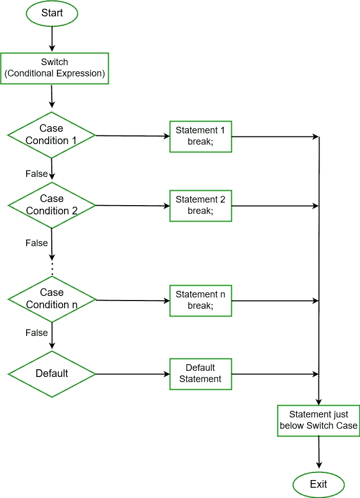

# c# 中的开关语句

> 原文:[https://www.geeksforgeeks.org/switch-statement-in-c-sharp/](https://www.geeksforgeeks.org/switch-statement-in-c-sharp/)

在 C# 中，Switch 语句是一个多路分支语句。它提供了一种基于表达式值将执行转移到代码不同部分的有效方法。开关表达式是整数类型，如 int、char、byte 或 short，或者是枚举类型，或者是字符串类型。检查表达式的不同情况，并执行一个匹配。

**语法:**

```cs
switch (expression) {

case value1: // statement sequence
     break;

case value2: // statement sequence
     break;
.
.
.
case valueN: // statement sequence
     break;

default:    // default statement sequence
}

```

**流程图:**



**需要记住的要点:**

*   在 C# 中，不允许出现重复的大小写值。
*   开关中变量的数据类型和案例的值必须属于同一类型。
*   大小写的值必须是常量或文字。不允许变量。
*   break in switch 语句用于终止当前序列。
*   默认语句是可选的，可以在 switch 语句中的任何地方使用。
*   不允许多个默认语句。

**示例:**

```cs
// C# program to illustrate
// switch case statement
using System;

public class GFG {

    // Main Method
    public static void Main(String[] args)
    {
        int nitem = 5;
        switch (nitem) {

        case 1:
            Console.WriteLine("case 1");
            break;

        case 5:
            Console.WriteLine("case 5");
            break;

        case 9:
            Console.WriteLine("case 9");
            break;

        default:
            Console.WriteLine("No match found");
            break;
        }
    }
}
```

**Output:**

```cs
case 5

```

#### 为什么我们使用 Switch 语句而不是 if-else 语句？

我们使用 switch 语句而不是 if-else 语句，因为 if-else 语句只适用于值的少量逻辑计算。如果您在大量可能的情况下使用 if-else 语句，那么它将花费更多的时间来编写，并且变得难以阅读。

**示例:**使用 if-else-if 语句

```cs
// C# program to illustrate
// if-else statement
using System;

class GFG {

    // Main Method
    public static void Main(String[] args)
    {
        // taking two strings value
        string topic;
        string category;

        // taking topic name
        topic = "Inheritance";

                // using compare function of string class
        if ((String.Compare(topic, "Introduction to C#") == 0) || 
            (String.Compare(topic, "Variables") == 0) || 
            (String.Compare(topic, "Data Types") == 0))
        {
            category = "Basic";
        }

                // using compare function of string class
        else if ((String.Compare(topic, "Loops") == 0) || 
                 (String.Compare(topic, "If Statements") == 0) || 
                 (String.Compare(topic, "Jump Statements") == 0)) 
        {
            category = "Control Flow";
        }

                // using compare function of string class
        else if ((String.Compare(topic, "Class & Object") == 0) || 
                 (String.Compare(topic, "Inheritance") == 0) || 
                 (String.Compare(topic, "Constructors") == 0)) 
        {
            category = "OOPS Concept";
        }

        else 
        {
            category = "Not Mentioned";
        }

        System.Console.Write("Category is " + category);
    }
}
```

**Output:**

```cs
Category is OOPS Concept

```

**说明:**如上图所示，程序代码并不过分，但是看起来读起来比较复杂，写起来要花更多的时间。因此，我们使用 switch 语句来节省时间并编写优化的代码。使用 switch 语句将提供更好的代码可读性。

**示例:**使用开关语句

```cs
// C# program to illustrate
// switch statement
using System;

class GFG {

    // Main Method
    public static void Main(String[] args)
    {
        // taking two strings value
        string topic;
        string category;

        // taking topic name
        topic = "Inheritance";

        // using switch Statement
        switch(topic)
        {
            case "Introduction to C#":
            case "Variables":
            case  "Data Types":

                category = "Basic";
                break;

             case "Loops":
             case"If Statements":
             case"Jump Statements":

                category = "Control Flow";
                break;

             case "Class & Object":
             case "Inheritance":
             case "Constructors":

                category = "OOPS Concept";
                break;

             // default case 
             default:
                category = "Not Mentioned";
                break;

        }

        System.Console.Write("Category is " + category);
    }
}
```

**Output:**

```cs
Category is OOPS Concept

```

#### 在 Switch 语句中使用 goto

也可以用**[【goto】](https://www.geeksforgeeks.org/c-sharp-jump-statements-break-continue-goto-return-and-throw/)**语句代替 switch 语句中的 break。通常，我们使用 break 语句退出 switch 语句。但是在某些情况下，需要执行默认语句，所以我们使用 goto 语句。它允许在 switch 语句中执行默认条件。goto 语句也用于跳转到 C# 程序中的标记位置。

**示例:**

```cs
// C# program to illustrate the
// use of goto in switch statement
using System;

public class GFG {

// Main Method
public static void Main(String[] args)
    {
        int greeting = 2;

        switch (greeting) {
        case 1:
            Console.WriteLine("Hello");
            goto default;
        case 2:
            Console.WriteLine("Bonjour");
            goto case 3;
        case 3:
            Console.WriteLine("Namaste");
            goto default;
        default:
            Console.WriteLine("Entered value is: " + greeting);
            break;
        }
    }
}
```

**Output:**

```cs
Bonjour
Namaste
Entered value is: 2

```

**说明:**在上述程序中，goto 语句用在 switch 语句中。这里首先打印案例 2，即 *Bonjour* ，因为开关包含的问候值为 2，然后由于 goto 语句的存在，控制转移到案例 3，因此它打印 Namaste，最后控制转移到默认条件，打印输入值为:2。

**注意:**如果你的 switch 语句是循环的一部分，那么你也可以用 continue 来代替 break in switch 语句，那么 continue 语句会让执行瞬间回到循环的开始。