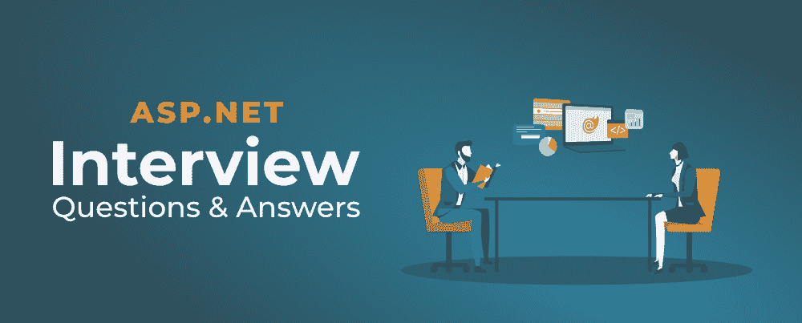
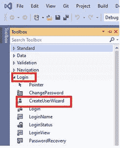
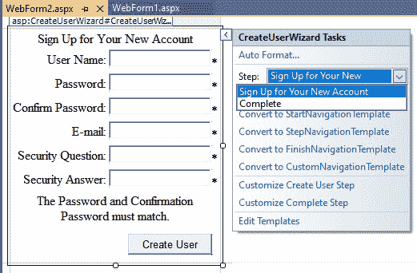

# ASP.NET 50 强面试问答

> 原文:[https://www . geesforgeks . org/top-50-ASP-net-面试-问答/](https://www.geeksforgeeks.org/top-50-asp-net-interview-questions-and-answers/)

ASP.NET 是微软开发的一个开源网络应用框架，它是。NET 框架，经典的活动服务器页面(ASP)的继承者。这用于创建 web 服务和应用程序。在这里，我们列出了 ASP.NET 50 大面试问题及其答案。问题从基础到高级。所以这些将帮助你破解面试。我们开始吧。



**1。什么是 ASP.NET？**

ASP.NET(活动服务器页面。NET)是一个进步的新编程框架，能够快速改进强大的 web 应用程序和管理。它是微软的一部分。NET 平台，它提供了创建、部署和运行 web 应用程序的最简单和最通用的方法，可以专注于任何浏览器，或者 device.ASP.NET 是建立在 CLR(公共语言运行时)之上的，它允许程序员使用任何。NET 语言(C#、VB 等。).它是专门为使用 HTTP 和 web 开发人员创建动态网页、web 应用程序、网站和 web 服务而设计的，因为它提供了 HTML、CSS 和 JavaScript 的良好集成。

。NET Framework 用于创建各种应用程序和服务，如控制台、网络和窗口等。但是 ASP.NET 只用于创建网络应用程序和网络服务。这就是为什么我们把 ASP.NET 称为。NET 框架。

**2。写下 ASP.NET 的特色？**

ASP.NET 在开发商中受欢迎有很多原因。下面列出了一些原因:

*   **延伸。NET 框架:**ASP.NET 是。NET 框架，因为它扩展了。NET 框架和一些开发网络应用的库和工具。它给。NET Framework 是用于常见 web 模式的*库，如 MVC* 、*编辑器扩展*、*处理 web 请求的基础框架*和*网页模板语法，如 Razor* 等。
*   **性能:**比市面上其他可用的 web 框架都要快。
*   **后端代码:**在 ASP.NET 的帮助下，你可以用 C#编写数据访问和任何逻辑的后端代码。
*   **动态页面:**在 ASP.NET，Razor 借助 C#和 HTML 提供了开发动态网页的语法。ASP.NET 可以和 JavaScript 集成在一起，它还包括了像“反应”和“角度”这样的框架。)
*   **支持不同的操作系统:**可以在 Windows、Linux、Docker、macOS 上开发执行 ASP.NET 应用。Visual Studio 提供了构建工具。不同操作系统的. NET 应用。

**3。什么是公共语言运行时？**

CLR 是的基本和虚拟机组件。NET 框架。中的运行时环境。NET Framework，它运行代码，并通过提供各种服务(如远程处理、线程管理、类型安全、内存管理、健壮性等)来帮助简化开发过程。基本上，它负责管理。NET 程序，无论任何。NET 编程语言。它还有助于管理代码，因为以运行时为目标的代码称为托管代码，不以运行时为目标的代码称为非托管代码。

*想了解更多，可以参考* [*【公共语言运行库】*](https://www.geeksforgeeks.org/common-language-runtime-clr-in-c-sharp/)

**4。什么是 ASP.NET MVC 框架？**

ASP。MVC 是一个轻量级的 web 应用框架，具有很高的可测试性。ASP.NET 支持 3 种不同类型的组件，即模型、视图和控制器。

*   **模型层:**模型组件对应于用户使用的所有或任何数据相关逻辑。这将表示视图和控制器组件之间传输的信息或其他业务逻辑相关数据。例如，客户对象将从数据库中检索客户信息，对其进行操作，并将其数据更新回数据库或使用它来呈现数据。
*   **视图层:**视图组件用于设备的所有用户界面逻辑。例如，客户视图将包括所有用户界面组件，如文本框、下拉列表等。最终用户与之交互。
*   **控制器:**控制器充当模型和考虑组件之间的接口，以处理所有业务逻辑和传入请求，使用模型组件操作数据，并与视图交互以呈现最终输出。例如，客户控制器将处理来自客户视图的所有交互和输入，并使用客户模型更新数据库。一个等效的控制器将习惯于查看客户数据。

**5。ASP.NET MVC 和 ASP.NET 网络应用编程接口哪个是合适的框架？**

*   ASP.Net MVC 用于制作返回视图和数据的 web 应用程序，而 Asp.Net Web API 用于以简单而基本的方式制作所有 HTTP 服务，只返回信息，不返回视图。
*   网络应用编程接口有助于在网络上构建 REST-ful 服务。NET 框架，并且它还支持内容协商，这是 MVC 中没有的。
*   网络应用编程接口还处理返回特定设计的信息，如 JSON、XML 或其他一些依赖于招标中的接受头的信息，您不必为此而紧张。MVC 只是利用 Json Result 在 JSON 设计中返回信息。

**6。什么是服务器控制？**

ASP.NET 有服务器控制功能，为服务器端控制的操纵值提供了便利。当我们想要创建验证和动态 web 表单时，这尤其有用。

**7。web.config 文件是什么？**

一个配置文件(web.config)被用来监督一个网站的不同设置。设置存储在独立于应用程序代码的 XML 文件中。通过这种方式，您可以从代码中自由配置设置。该文件存储在应用程序根目录中。


**8。ASP.NET 用的是哪个编译器？**

编写了一个 ASP.NET 程序。NET 框架使用了罗斯林编译器。

**9。ASP.NET 是开源的。解释一下？**

ASP.NET 是一个开源的网络框架，用于在。NET (dotNET)框架。它由微软制造，变体 1.0 于 2002 年交付，允许用户开发动态网络应用程序、服务和网站。该框架旨在与标准的 HTTP 约定一起工作，这是所有基于 web 的应用程序使用的标准协议。ASP.NET 是 ASP(活动服务器页面)创新的替代者，在适应性和能力方面是一个重大的更新。它是。NET 框架，带有额外的工具和库，用于在网络上构建东西，包括网络应用程序和网站。ASP.NET 十字板形式的版本被称为 ASP.NET 核心，于 2016 年交付。ASP.NET 仍然得到更新和支持。

**10。解释 Global.asax 文件？**

Global.asax 是驻留在应用程序根目录中的可选文件。此文件用于处理更高级别的应用程序事件，例如，应用程序开始、应用程序结束、会话开始、会话结束等。它也被称为 ASP.NET 应用程序文件..Global.asax 包含一个表示应用程序整体的类。在运行时，该文件被解析并编译成动态创建的。NET 框架类派生自 HTTP 应用程序基类。我们可以在 ASP.NET 应用程序的\bin 目录中将此文件作为程序集传送。Global.asax 记录本身是这样设计的，如果用户要求文档，请求就会被拒绝。外部用户不能下载或者看到里面写的代码。


**11 时。ASP.NET 支持多少种类型的服务器控件？**

ASP.NET 主要有四种不同类型的服务器端控件:

*   HTML 服务器控件
*   网络服务器控件
*   用户控件
*   验证控制

**12 时。“回发”在 ASP.NET 是什么意思？**

回发是将 ASP.NET 页面呈现给服务器进行处理的过程。如果要根据某些来源检查页面的某些凭据，就会完成回发(例如，使用数据库确认用户名和密钥/密码)。这是客户端机器无法实现的，随后，这些细节必须“发布”回服务器。因此，我们可以说回发事件发生在客户端，但由服务器上运行的页面副本中的代码处理。

**13。解释 Web.config 和 Machine.config 文件的区别？**

Web.config 和 Machine.config 文件之间有一些关键的区别，如下所示:

*   machine.config 记录是您的框架上的主配置文档，包含许多默认设置。Web.config 是为网站应用的本地设置文件，该网站以 XML 格式存储配置信息。
*   Machine.config 文件的设置应用于服务器上的整个 ASP.NET 应用程序，而 Web.config 文件中的设置仅应用于特定的 Web 应用程序。
*   每一个。NET Framework 表单只有一个 machine.config 文件，同时每个 web 应用程序都有自己的 web.config 文件。web 应用程序中的目录也可以有 web.config 文件。
*   machine.config 是服务器上许多应用程序共享的值，而 Web.config 文档包含应用程序显式的东西，例如数据库连接字符串。
*   假设如果您想对 web.config 进行任何改进，那么 web 应用程序会立即加载更改，但是在 machine.config 的情况下，您应该重新启动应用程序。
*   当您安装 Visual Studio.Net 时，machine.config 文档将自动引入，并且它驻留在 c:\ windows \ Microsoft . net \ framework \ version \ config 文件夹中，而 web.config 将在您创建 ASP.Net web 应用程序项目时自动生成。
*   Machine.config 是 IIS 中所有应用程序的设计配置文件，但是 Web。config 是特定应用程序的配置文件。

**14。在 ASP.NET MVC 框架中为请求流写一个步骤？**

ASP.NET MVC 中请求流的顺序如下:

*   **请求**:该步骤首先接收请求。之后，在 Global.asax 文件中，路由对象被添加到路由表对象中。
*   **走线**:第二步走线。在应用程序从客户端获得后，它使用 URL 路由模块来处理请求。路由表将网址引导至处理程序。路由与一个系统相协调，该系统将请求的网址与路由表中可用的网址模式相匹配。当在模式中找到匹配时，路由引擎将请求转移到相关的 IRouteHandler。假设在路由表中没有找到相关的网址，它将返回一个 404 HTTP 状态代码。
*   **MVC 处理程序**:一个 RouteHandler，负责根据接收到的 RequestContext 决定将为请求服务的 HTTP 处理程序。
*   **控制器**:在这个步骤中，控制器决定执行哪种动作方式。
*   **执行的动作:**控制器实例化后，ActionInvoker 将决定需要执行哪个 Action 方法。用于选择操作方法的操作名称选择属性和操作方法选择属性方法。action 方法接收用户输入，然后执行结果并返回结果类型进行查看。

**15。解释 ASP.NET 会话状态的各种模式？**

*   **InProc** :会话存储在网络服务器上的应用程序进程中。根据所使用的 IIS 格式副本，可能是 aspnet 或 w3wp.exe。
*   **状态服务器**:利用状态服务器窗口管理服务存储会话。
*   **SQLServer** :利用 SQLServer 数据库存储会话信息。
*   **自定义**:自定义会话状态提供者管理所有会话状态。

**16。写下控制器动作方法的不同返回类型？**

*   查看结果
*   Javascript 结果
*   重定向结果
*   JSON 结果
*   内容结果

**17。如何在 MVC 中维护会话？**

我们可以使用三种不同的方式在 MVC 中维护会话:

*   临时数据
*   可视数据
*   查看包

**18。解释 GridView 和 DataGrid 的区别？**

<figure class="table">

| 网格视图， | 数据网格 |
| --- | --- |
| 它是随 Asp.Net 2.0 一起推出的。 | 它是随着 Asp.Net 1.0 一起推出的。 |
| 分页和排序的内置支持。 | 对于排序，您需要处理所需的 SortCommand 事件和重新绑定网格，对于分页，您需要处理所需的 PageIndexChanged 事件和重新绑定网格。, |
| 更新和删除操作的内置支持。 | 需要编写代码来实现更新和删除操作。 |
| 支持自动格式化或样式功能。 | 不支持此功能。 |
| 与数据网格相比，性能较慢 | 与 GridView 相比，性能更快。 |

</figure>

**19。自定义控件和用户控件有什么区别？**

<figure class="table">

| 

**用户控制**

 | 

**自定义控制**

 |
| --- | --- |
| 用户控件就像 web 窗体一样创建。他们利用现有的控件来定义自己的逻辑。

 | 自定义控件是程序员通过扩展现有控件的功能，为满足业务需求而制作或创建的控件。 |
| 我们可以轻松控制用户。 | 与用户控件相比，创建自定义控件并不容易 |
| 这些控件不在自己的 dll 上运行。 | 虽然这些控件可以在自己的 dl 上运行。 |
| 我们不能加入工具箱。 | 我们可以添加到工具箱中 |
| 这种控制不灵活。 | 这种控制更加灵活。 |
| 一旦我们创建了这个控件的单个副本，我们也可以将这个副本用于不同的项目。 | 我们不能在不同的应用程序中调用或使用这个控件的单个副本。为此，我们需要为每个应用程序创建一个控件。 |

</figure>

**20。ASP.NET 的网络控制是什么？**

Web 服务器控件比 HTML 服务器端控件更强大。唯一不同的是，它们必须设置 **runat = "server"** 属性。此属性使控件可用于服务器端编程。每个 ASP.NET 服务器控件都能够公开包含属性、方法和事件的对象模型。ASP.NET 开发人员可以利用这个对象模型来修改网页并与之交互。网页控件包含 HTML 控件的所有基本控件以及一些新控件，如数据网格、数据列表和日历。

<figure class="table">

| **网络控制** | **描述** |
| --- | --- |
| 标签 | 表示标签控件 |
| 列表框 | 表示列表框控件 |
| 检验盒 | 表示复选框控件 |
| 日历 | 表示日历控件 |
| 图像按钮 | 表示图像按钮控件 |
| TableCell(表格单元) | 表示表格单元格 |
| 面板 | 表示面板控件 |
| 数据列表 | 表示数据列表控件 |
| 文本框 | 表示文本框控件 |
| 图像 | 表示图像控件 |
| 复选框列表 | 表示带有复选框的列表框 |
| 纽扣 | 表示按钮控件 |
| 超链接 | 表示超链接控件 |
| TableRow(表格列) | 表示表格的一行 |
| 单选按钮列表 | 表示带有单选按钮控件的列表框 |
| 数据网格 | 表示数据网格控件 |
| DropDownList | 表示下拉列表控件 |
| 广告旋转器 | 表示广告旋转器控件 |
| 单选按钮 | 表示单选按钮控件 |
| 链接按钮 | 表示链接按钮控件 |
| 桌子 | 表示表控件 |
| 中继器 | 表示中继器控件 |

</figure>

**21。描述 ASP 中的登录控件？**

ASP.NET 支持一个强大的基于网络的应用程序登录控制，不需要任何程序编码。这些登录控件与 ASP.NET 的参与和表单身份验证相协调，有助于服务器网页的自动客户端验证。默认情况下，ASP.NET 登录控件通过 HTTP 以纯文本方式工作。ASP.NET 支持不同类型的登录控件，例如:

*   登录控件
*   登录视图控件
*   loginstatus control 登入状态控制
*   登录名称控制
*   密码恢复控制
*   创建用户向导控件
*   更改密码控制

 

**22。你如何解释 Repeater 和 ListView 的区别？**

中继器控件是从控件类派生的。中继器只是重复模板中给出的数据。重复数据通常是混合了来自数据源的记录的 HTML 代码。中继器的输出不是预定义的。正因为如此，Repeater 需要大部分工作来定义模板。作为回报，它为我们提供了构建布局和优化演示的最大灵活性。

使用相同的模板和相同的数据集，Repeater 通常比 Data List 或 GridView 控件工作得更快。这主要是因为用于只读访问的 DataReader 类。DataReader 比 GridView 常用的 DataSet 或 DataTable 类更快。

与 GridView 和 DataList 控件相比，Repeater 的功能有限。默认情况下，Repeater 非常适合显示数据。如果您需要编辑数据，这不是最佳选择。此外，默认情况下，它不提供记录的分页和排序。

ListView 控件是最新的数据呈现控件，在 ASP.NET 3.5 中引入。以前的控件(Repeater、DataList 和 GridView)在逻辑上是相互跟随的。例如，Repeater 最简单，但速度最快，然后 DataList 有更多的功能，但开销也更大，最后 GridView 最复杂，功能最多，但最重，因此在页面上最慢。现在，有了一个新的 ListView 控件，它试图从两个方面提供最好的东西:设计的速度和灵活性，以及许多功能，如分页、更新或删除记录等。正因为如此，ListView 控件通常是比 Repeater 或 DataList 更好的选择。

**23。ASP.NET 有哪些不同的验证控制？**

ASP.NET 的验证控制是 Web 应用程序创建的重要要求之一。这些控件为验证用户输入提供了便利。通过使用这些控件，我们可以检查所需的字段、范围、自定义规则、条件等。ASP.NET 有 5 种不同类型的验证控制:

*   **RequiredFieldValidator** :如果我们希望用户必须填写某些必填字段，则使用该验证控件。
*   **比较器**:该验证使用比较运算符将用户输入与值进行比较，如小于、大于等。
*   **范围验证器**:该验证检查用户的输入值是否在一定范围内。
*   **正则表达式验证器**:它检查用户的输入字符串是否与定义的模式匹配。
*   **自定义验证器**:该验证用于检查用户自定义的验证条件。

**24。描述 ASP 中的逻辑状态控件？**

ASP.NET 支持一个强大的基于网络的应用程序登录控制，不需要任何程序编码。LoginStatus 控件是一个非常简单的控件，它所做的只是根据用户是登录还是注销来显示不同的链接。如果用户登录了，它会显示 LogOut 链接，反之亦然。

它支持的属性很少，登录操作可用于指定当用户单击登录链接时会发生什么，选项有重定向、重定向登录页面、刷新。如果我们将其设置为重定向，那么我们必须设置另一个属性登录页面网址，用户在注销网站后会被重定向到该网址。

```
<%@ Page Language="C#" AutoEventWireup="true" 
CodeBehind="WebForm1.aspx.cs" Inherits="WebApplication10.WebForm1" %>

<!DOCTYPE html>

<html xmlns="http://www.w3.org/1999/xhtml">
<head runat="server">
    <title></title>
</head>
<body>
    <form id="form1" runat="server">
        <div>
            Welcome To GeeksForGeeks<br />

            <asp:LoginStatus ID="LoginStatus1" runat="server"
             ForeColor="#CC0000" LoginText="Click here for Login" />
            <br />
            <br />

            <asp:LoginStatus ID="LoginStatus2" runat="server" 
            ForeColor="#CC0000" LoginText="Click here to Logout" />
            <br />
            </div>
    </form>
</body>
</html>
```

**输出:**


**25。为什么我们在中使用 CheckBox。NET？**

此控件在 Web 窗体页上创建一个复选框，允许用户为与该控件关联的项设置真值或假值。复选框的属性包括:

*   **选中:**如果复选框被选中，则为真，否则为假。默认值为假。
*   **TextAlign:** TextAlign 是字幕的位置。可能的值有右和左。默认为右对齐。
*   **文本:**定义复选框标题。

```
<%@ Page Language="C#" AutoEventWireup="true" CodeBehind="WebForm2.aspx.cs"
 Inherits="WebApplication10.WebForm2" %>

<!DOCTYPE html>

<html xmlns="http://www.w3.org/1999/xhtml">
<head runat="server">
    <title></title>
    <style type="text/css">
        #form1 {}
    </style>
</head>
<body>
    <form id="form1" runat="server">
        <div>
            <br />
            Eligibility criteria for take admission in Master of Technology
            <br />
        </div>
        <asp:CheckBox ID="CheckBox1" runat="server" Text="HSC" />
        <br />
        <asp:CheckBox ID="CheckBox2" runat="server" Text="SSC" />
        / Polytechnic<br />
        <asp:CheckBox ID="CheckBox3" runat="server" Text="BE" />
        <br />
        <br />
        <asp:Button ID="Button1" runat="server" 
        OnClick="Button1_Click" Text="Submit " />

        <asp:Label ID="Label1" runat="server" ForeColor="Lime" 
        Text="Label"></asp:Label>
    </form>
</body>
</html>
```

**输出 1:**


**输出 2:**


**26。解释一下 ASP.NET 的 HTML 服务器控件？**

**HTML 服务器控件:** HTML 元素暴露给服务器。它们公开了一个对象模型，该模型非常接近于它们所呈现的 HTML 元素。您可以通过定义 runat ="server "属性在服务器上运行这些控件。

<figure class="table">

| **控制** | **描述** |
| --- | --- |
| html 表单 | 创建一个 HTML 表单控件，用作其他控件的占位符。 |
| HtmlInputText | 创建用于从用户获取输入的输入文本框控件。 |
| html 文本区域 | 创建多行文本框控件。 |
| htmlanchor | 创建网站导航。 |
| html 按钮 | 创建按钮控件。 |
| HtmlImage | 创建用于显示图像的图像控件。 |
| HtmlInputCheckBox | 创建复选框控件。 |
| HtmlInputRadioButton | 创建单选按钮控件。 |
| html 表格 | 创建一个表控件。 |
| HtmlTableRow | 在表中创建一行。 |
| HtmlTableCell | 在行内创建一个单元格。 |

</figure>

**27。你对 JIT 了解多少？**

准时制编译器:准时制编译器是中公共语言运行时的一部分。NET，它负责管理。NET 程序，无论任何。NET 编程语言。特定于语言的编译器将源代码转换为中间语言。这种中间语言然后被实时编译器转换成机器代码。这种机器代码特定于运行 JIT 编译器的计算机环境。

*要了解更多信息，请参考《什么是准时制编译器》中的文章*[***。NET***](https://www.geeksforgeeks.org/what-is-just-in-time-jit-compiler-in-dot-net/) ***？*****

***28。什么是 LINQ？***

*LINQ 被称为**语言综合查询**，在*引进。NET 3.5* 和 Visual Studio 2008。LINQ 的美在于它提供了*的能力。NET* 语言(如 C#，VB.NET 等。)生成查询以从数据源检索数据。例如，程序可以从学生记录或访问员工记录等获取信息。在过去的几年中，这种类型的数据存储在与应用程序分开的数据库中，您需要学习不同类型的查询语言来访问这种类型的数据，如 SQL、XML 等。此外，您不能使用 C#语言或任何其他*创建查询。NET* 语言。*

*为了克服这类问题，微软开发了 LINQ。它给 C#或*增加了一个，更多的能量。NET* 语言来为任何 LINQ 兼容的数据源生成查询。最棒的是创建查询所用的语法是相同的无论使用哪种类型的数据源都意味着在关系数据库中创建查询数据的语法与创建存储在数组中的查询数据的语法相同没有必要使用 SQL 或任何其他 *non-。NET* 语言机制。您还可以将 LINQ 与 SQL、XML 文件、ADO.NET、web 服务以及任何其他数据库一起使用。*

***29。什么是 ASP.Net 的永久居留权？***

*RedirectPermanent(String)方法重载在反应中给出了一个 301 HTTP 状态代码，并结合了 URL 来转移请求。301 HTTP 状态代码是 HTTP 反应中的标准代码。它表明持久的重定向存在，并给出了重定向区域。*

***30。什么是 ASP.NET 核心？***

*ASP.NET 核心是 ASP.NET 的开源版本，可以在 macOS、Linux 和 Windows 上运行。ASP.NET 核心于 2016 年首次交付，是对以前的 Windows 版 ASP.NET 的重新规划。*

*2015 年 11 月，微软发布了 5.0 版本的 ASP.NET，后来被分离出来，被称为 ASP.NET 核心。此外，它被认为是 ASP.NET 的一个重要的重新设计，具有开源和跨平台的特点。在这个版本之前，ASP.NET 只被认为是一个 Windows 版本。*

***31。ASP.NET 的 AJAX 是什么？***

*ASP.NET AJAX 的完整形式是异步 JavaScript 和 XML。ASP.NET AJAX 也称为 AJAX，是 ASP.NET 的一系列扩展。它使用浏览器和 webserver 之间的异步数据传输，允许网页向服务器请求少量信息，而不是整个页面。这种技术使互联网应用程序更小、更快、更方便用户。它由微软创建，用于在网络应用程序中执行 AJAX 功能。ASP.NET AJAX 与 AJAX 库一起工作，利用对象排列编程(OOP)来更快地丰富网络应用程序。*

***32。什么是 ASP.NET 往返旅行？***

*如果包含服务器端处理，则包含四个阶段:*

1.  *用户向网络服务器请求网络表单。*
2.  *网络服务器对提到的网络表单做出反应。*
3.  *用户输入信息并将 web 表单提交给 web 服务器。*
4.  *然后，网络服务器处理表单结构，并将结果发送回特定用户。*

*现在，阶段 3 被称为页面回发，而阶段 3 和阶段 4 被统称为“往返”。我们可以这样说——“往返包括在网络上对网络浏览器进行一次全面的访问，并获得反馈。网络应用程序使用 HTTP 在网络程序和网络服务器之间建立通信。*

***33。ASP.NET 的剃刀是什么？***

*在 ASP.NET，Razor 在 C#和 HTML 的帮助下提供了开发动态网页的语法。ASP.NET 可以与 <u>JS(JavaScript)</u> 集成，它还包括了像 SPA(单页应用)的 React 和 Angular 这样的框架。)*

***34。什么是 REST 架构？***

*REST 代表**RE**presentative**S**tate**T**transfer。REST 是一种不遵循任何严格标准的建筑风格，但遵循罗伊·菲尔丁在 2000 年定义的六个约束。这些约束是——统一接口、客户机-服务器、无状态、可缓存、分层系统、按需编码。REST 并不局限于 XML，而是实现者选择使用哪种媒体类型，比如 XML、JSON、纯文本。而且 REST 可以使用 SOAP 协议，但是 SOAP 不能使用 REST。REST 易于实现，对智能手机等带宽要求更低。*

***RESTful API 的架构约束:**下面列出了构成任何 web 服务的六个架构约束:*

*   *统一界面*
*   *无国籍的*
*   *可缓冲的*
*   *客户端-服务器*
*   *分层系统*
*   *按需编码*

***35。ASP.NET 有哪些认证类型？***

*身份验证是根据用户的凭据检查用户身份的过程。通常，用户的凭据是用户标识和密码的形式，我们从数据库或等效的替代方案中检查他们的凭据，如果存在，则该用户是下一个流程(授权)的有效候选人。ASP.NET 有不同类型的认证，即:*

*   *表单验证*
*   *护照认证*
*   *Windows 身份验证*
*   *自定义身份验证*

***36。什么是缓存及其不同类型？***

*在 Asp.Net，缓存方法允许存储或缓存网页输出。该技术用于避免重新创建相同数据的开销。ASP 中有三种不同的缓存类型。NET:*

*   *页面输出缓存*
*   *页面片段缓存*
*   *数据缓存*

*如果用户请求相同的数据或信息，缓存会增加性能参数。*

*   ***页面输出缓存:**它是通过在。设计时的 aspx 页面。*
*   ***数据缓存:**用于应用数据的快速检索，由 Cache 对象实现。*
*   ***页面片段缓存:**通过缓存用户控件，将 Web 表单响应的一部分存储在内存中。*

***37。什么是 ASP 中的查询字符串？它的优点和缺点是什么？***

*查询字符串是输入到计算机网络浏览器中的字符的集合。当我们想要将一个值从一个页面转移到另一个页面时，这很有帮助。如果发送的数据量很大，那么我们不能使用请求。因为它只支持 255 个字符。我们使用“&”特殊字符来分隔多个查询字符串。任何可用于呼叫 ASPX 页面的查询字符串都将可用于被叫 ASPX 页面。*

***38。方法 Finalize 在 ASP.NET 做什么？***

*Finalize 技术用于在对象被销毁之前对当前对象持有的非托管资源执行清理过程。策略得到保证，随后可以通过这个类或通过一个派生类获得。*

***39。写下 ASP.NET 页面生命周期中所有步骤的名称？***

*   *页面请求*
*   *页面生命周期的开始*
*   *页面初始化*
*   *页面加载*
*   *确认*
*   *回发事件处理*
*   *页面呈现*
*   *倾销*

***40。简述网站和网络应用程序的区别？***

*web 应用程序是一个可以被浏览器访问的软件。浏览器是用于浏览互联网的应用程序。Web 应用程序需要身份验证。web 应用程序使用服务器端脚本和客户端脚本的组合来呈现信息。它需要一个服务器来管理来自用户的请求。例如，谷歌应用*

*网站是包含图像、文本、音频、视频等相关网页的集合。它可以由一页、两页和 n 页组成。网站提供用户可以查看和阅读的视觉和文本内容。查看网站需要浏览器(chrome、firefox)。有许多类型的网站，如档案网站，博客，社区网站，约会网站等。比如亚马逊、youtube 等。*

***41。解释视图状态？***

***查看状态**是 **ASP** 的方法。 **NET** 页面框架用于在往返之间保留页面和控件值。*

```
*<%@ Page Language="C#" AutoEventWireup="true" CodeBehind="WebForm4.aspx.cs" 
Inherits="WebApplication9.WebForm4" %>

<!DOCTYPE html>

<html xmlns="http://www.w3.org/1999/xhtml">
<head runat="server">
    <title></title>
</head>
<body>
    <form id="form1" runat="server">

         <div>
            <h6>Example of View State:</B></h6>
             <p><B><I><U>WELCOME TO GEEKSFORGEEKS</B></I></U></p>

            Page Counter:

             <br />
             <br />

         <asp:Label ID="lblCounter" runat="server" />
             <br />
             <br />
             <br />
             <asp:Button ID="btnIncrement" runat="server" 
             Text="Number of Visitors Count" OnClientClick="btnIncrement_Click"  />
         </div>
      </form>     
</body>
</html>*
```

***输出:***

**

***42。在 ASP.NET 解释饼干？***

*Cookie 可以被定义为小块信息，这些信息可以通过服务器程序发送到浏览器，并由互联网浏览器存储。然后，互联网浏览器会在每次从服务器发出请求时将 Cookies 传递回服务器。这对于允许验证/认证特别有帮助。*

*假设，当用户登录到密码受限的系统时，cookie 会存储用户信息(用户名、密码)。因此，客户端不需要为他们希望下载的每个新页面重新输入详细信息。cookie 属性获取客户端 cookie 变量的集合。*

***43。解释在 ASP.NET 使用网络服务的目的？***

*Web 服务是一个 web 应用程序，基本上是一个由不同应用程序可以使用的方法组成的类。它同样遵循代码隐藏设计，例如 ASP.NET 页面，尽管它没有用户界面。*

***44。什么是追踪？NET？***

*ASP.NET 包括一个易于使用的功能，帮助调试网络应用程序。跟踪功能允许调试打印语句插入到代码中，以输出变量或结构，断言是否满足条件，或者跟踪应用程序的执行路径。跟踪功能用于跟踪已部署应用程序中特定类型的操作(例如，数据库连接)，因此可以监控应用程序的效率。ASP.NET 的新追踪功能允许模拟**响应。编写()**语句。用户无需担心在部署应用程序之前删除语句。而不是使用响应。写()，跟踪。使用了 Write()。跟踪对象是一个内部页面对象，类似于请求、响应、服务器等。它可以通过页面代码直接访问。*

***Trace 类:**Trace 类用于获取 Trace 的相关信息。当使用跟踪属性时，在系统中定义跟踪上下文类的实例。Web 命名空间。Trace 类提供了一组有助于跟踪代码执行的方法和属性。检测允许监控在现实环境中运行的应用程序的运行状况。跟踪有助于隔离问题并在不干扰正在运行的系统的情况下修复它们。*

**启用追踪有两种不同的方式:**

*   *在 C#或 C++的托管扩展中，/d: TRACE 标志可以添加到编译器命令行中。在 Visual Basic 中，/d: TRACE=True 标志可以添加到编译器命令行中*
*   *#define TRACE 可以添加到文件的顶部。该语法是编译器特定的。如果用户使用的编译器不是上面指定的编译器，则必须参考编译器的文档来启用条件编译*

***45。写下 ASP.NET 提供的不同追踪方法？***

*   ***断言()**–检查条件，如果条件为假，则显示一条消息。*
*   ***Close()**–清理输出缓冲区，然后关闭监听器，使其不再接收调试输出。*
*   ***失败()**–该方法会发出错误消息。*
*   ***获取类型()**–用于“获取对象的类型”。*
*   ***ToString()**–返回表示当前对象的字符串*
*   ***GetHashCode()**–该方法的工作方式类似于特定类型的哈希函数。它适用于哈希算法和像哈希表这样的数据结构。*
*   ***等于()**–确定指定的对象是否与当前对象是同一个实例*
*   ***Warn()**–将跟踪信息以及可选的异常数据写入跟踪日志。所有警告都显示为红色文本。它有两种形式。第一种形式将跟踪信息写入跟踪日志，包括任何用户定义的类别。*
*   ***Write()**–将跟踪信息写入跟踪日志。它有两种形式。第一种形式将跟踪信息写入跟踪日志，包括任何用户定义的类别和跟踪消息。*

***46。解释本地资源和全球资源？***

*本地资源对于特定的页面是显式的，特定的页面可以访问本地资源，而全局资源可以从任何地方访问。本地资源保存在应用程序本地资源管理器中，而全局资源保存在应用程序全局资源文件夹中。本地和全局资源记录看起来是相同的，所以唯一的区别是它们所在的文件夹。但是它们的用途不同。*

***47。写下 ASP.NET 的各种页面事件？***

*   *PreInit(启动前)*
*   *初始化*
*   *InitComplete*
*   *LoadViewState*
*   *LoadPostData*
*   *事先装好*
*   *负荷*
*   *LoadComplete*
*   *更有趣*
*   *PreRenderComplete*
*   *savestatecomplete*
*   *倾销*

***48。什么是 ASP.NET 的导航控制？***

*导航控件被定义为可以存储在文件中的菜单，以便于维护。这个文件通常被称为 web。站点地图，并存储在网站的根目录中。ASP.NET 有三种不同类型的导航控制:*

*   *动态菜单*
*   *TreeView*
*   *站点地图路径*

***49。描述 TreeView 控件？***

*TreeView 控件由节点组成。树中的每个条目被称为一个节点，并由一个树节点对象表示。包含其他节点的节点称为父节点。由另一个节点包含的节点称为子节点。没有子节点的节点称为叶节点。不包含在任何其他节点中的节点，但它是根节点中所有其他节点的祖先。节点既可以是父节点，也可以是子节点，但是根节点、父节点和叶节点是互斥的。节点的几个视觉和行为属性取决于节点是根节点、父节点还是叶节点。*

***50。解释 ADO.net？***

*在数据访问方面，ASP.NET 引入了被称为 ADO.NET 的下一代 ADO。ADO.NET 更强调不相连的记录集，采用 XML 作为这些记录集之间的通信媒介，DataStore.ADO.NET 是最新的数据库访问技术，始于开放数据库连接(ODBC)应用程序编程接口(API)。微软引入了开放式数据库连接，承诺为数据库创建单一的通用访问方法。自早期以来，ODBC 已经走过了漫长的道路。现在使用的几乎每个主要数据库都支持 ODBC 驱动程序，第三方开发人员提供了优化的驱动程序版本。ODBC 的主要焦点是为数据库数据源提供一致的接口。*