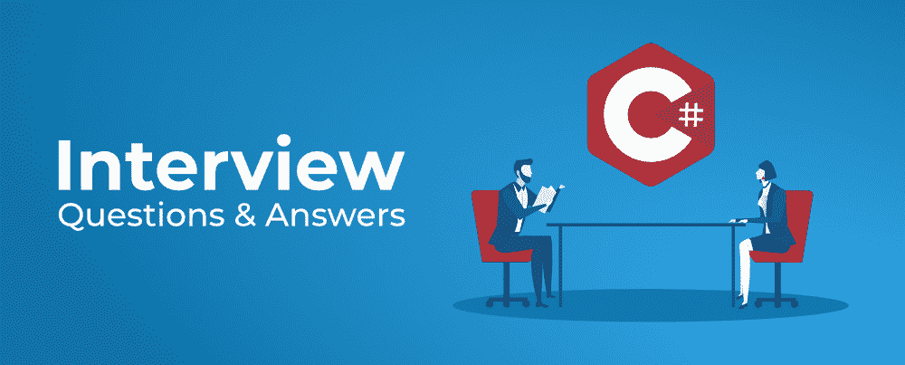
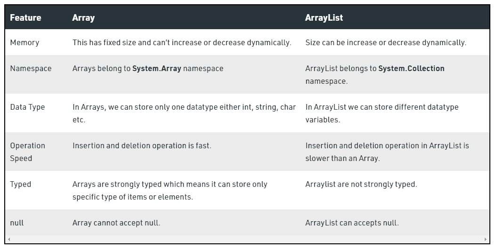
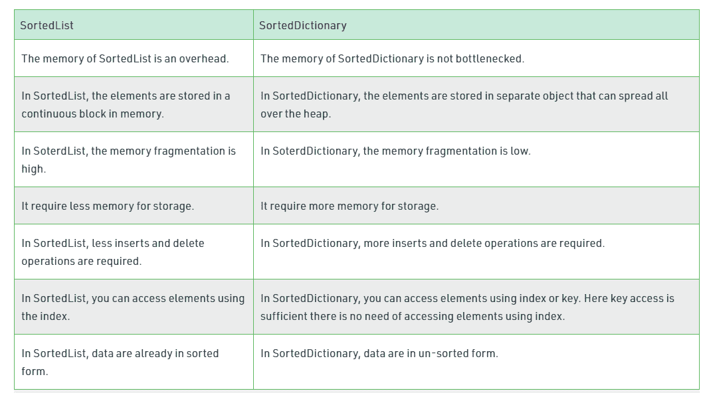

# 前 50 名 C#面试问题&答案

> 原文:[https://www . geesforgeks . org/top-50-c-sharp-面试-问题-答案/](https://www.geeksforgeeks.org/top-50-c-sharp-interview-questions-answers/)

C#是一种现代的、面向对象的通用编程语言。它是由微软与。NET 倡议。在这里，我们已经涵盖了前 50 个 C#面试问题及其答案。这些是 C#面试中常见的面试问题，专为新生设计。让我们开始吧。



**1。什么是 C#？**

C#是一种面向对象的现代编程语言，由微软创建。它运行在。NET 框架。C#非常接近[<u>C</u>](https://www.geeksforgeeks.org/c-programming-language/)/[<u>c++</u>](https://www.geeksforgeeks.org/c-plus-plus/)和 [<u>Java</u>](https://www.geeksforgeeks.org/java/) 编程语言。该语言被认为是一种简单、现代、通用、面向对象的编程语言。该语言用于创建软件组件。

**2。C#与******C 编程语言有何不同？****

<figure class="table">

| 

S.NO

 | 

c 程序设计语言

 | 

C#编程语言

 |
| --- | --- | --- |
| 1. | c 语言支持过程编程。 | 而 C#支持面向对象编程。 |
| 2. | c 语言支持指针。

 | 而在 C#中，指针只在不安全模式下使用。 |
| 3. | 在 C 语言中，垃圾收集不是。 | 而在 C#中，垃圾收集由公共语言运行库(CLR)管理。 |
| 4. | c 语言可以跨平台执行。 | 然而。NET 框架是执行 C#语言所必需的。 |
| 5. | 通过使用 C 语言，我们可以实现较低的抽象层次。 | 而通过使用 C#我们可以实现高度的抽象。

 |
| 6. | c 语言更注重函数。 | 而 C#更注重设计。 |
| 7. | c 语言给出了一流的性能。 | 而 C#给出了一个目标标准性能。 |
| 8. | C 语言总共使用了 32 个关键词。 | 而 C#中总共使用了 86 个关键字。 |
| 9. | c 语言主要用于商业行业和工程。 | 而 C#用于软件形成和其他与网络相关的目标。 |

</figure>

****3。什么是公共语言运行时？****

**CLR 是的基本和虚拟机组件。NET 框架。中的运行时环境。NET Framework，它运行代码，并通过提供各种服务(如远程处理、线程管理、类型安全、内存管理、健壮性等)来帮助简化开发过程。基本上，它负责管理。NET 程序，无论任何。NET 编程语言。它还有助于管理代码，因为以运行时为目标的代码称为托管代码，不以运行时为目标的代码称为非托管代码。*要了解更多信息，请参考*至*文章:* [*公共语言运行库。*](https://www.geeksforgeeks.org/common-language-runtime-clr-in-c-sharp/)**

****4。** **什么是 C#中的索引器。NET？****

**索引器在 C#中被称为智能数组。它允许以与数组相同的方式对类的实例进行索引。*阅读更多，参考*至*文章:* [*C#索引器*](https://www.geeksforgeeks.org/c-sharp-indexers/)**

****5。** **什么是 JIT 编译器流程？****

**准时制编译器是公共语言运行库的一部分。NET，它负责管理。NET 程序，无论任何。NET 编程语言。特定于语言的编译器将源代码转换为中间语言。这种中间语言然后被实时编译器转换成机器代码。这种机器代码特定于运行 JIT 编译器的计算机环境。*要了解更多信息，请参考文章*:*[*什么是准时制编译器。NET*](https://www.geeksforgeeks.org/what-is-just-in-time-jit-compiler-in-dot-net/) *？****

****6。C#中什么是垃圾收集？****

**中的垃圾收集使自动内存管理成为可能。NET 框架。当一个类对象在运行时被创建时，一定的内存空间在堆内存中被分配给它。然而，在程序中完成与对象相关的所有操作后，分配给它的内存空间是一种浪费，因为它无法使用。在这种情况下，垃圾收集非常有用，因为它会在不再需要内存空间后自动释放内存空间。**

**垃圾收集将始终在托管堆上工作，并且在内部它有一个引擎，称为优化引擎。如果满足多个条件中的至少一个，就会发生垃圾收集。这些条件如下:**

*   **如果系统的物理内存很低，那么垃圾收集是必要的。**
*   **如果分配给堆内存中各种对象的内存超过预设阈值，就会发生垃圾收集。**
*   **如果 GC。调用 Collect 方法，然后进行垃圾收集。但是，该方法仅在异常情况下调用，因为通常垃圾收集器会自动运行。**

***阅读更多，参考*至*文章:*[*c#垃圾收集*](https://www.geeksforgeeks.org/garbage-collection-in-c-sharp-dot-net-framework/) *。***

****7。C#中的类有哪些类型？****

*   **抽象类**
*   **部分类别**
*   **密封类**
*   **静态类**

****8。C#抽象类和接口有什么区别？****

<figure class="table">

| 

抽象类

 | 

连接

 |
| --- | --- |
| 它包含声明和定义两部分。 | 它只包含一个声明部分。 |
| 多重继承不是通过抽象类实现的。 | 多重继承是通过接口实现的。 |
| 它包含一个构造函数。 | 它不包含构造函数。

 |
| 它可以包含静态成员。 | 它不包含静态成员。 |
| 它可以包含不同类型的访问修饰符，如公共、私有、受保护等。 | 它只包含公共访问修饰符，因为接口中的所有内容都是公共的。 |
| 抽象类的性能很快。 | 接口的性能很慢，因为它需要时间在相应的类中搜索实际的方法。 |
| 它用于实现类的核心标识。 | 它用于实现类的外围能力。 |
| 一个类只能使用一个抽象类。 | 一个类可以使用多个接口。 |
| 如果许多实现是同类的并且使用共同的行为，那么最好使用抽象类。 | 如果很多实现只共享方法，那么使用接口更好。 |
| 抽象类可以包含方法、字段、常数等。 | 接口只能包含方法。 |
| 它可以是完全的、部分的、接口的或不实现的。 | 应该全面实施。 |

</figure>

****9。C#中有哪些扩展方法？****

**在 C#中，扩展方法概念允许您在现有类或结构中添加新方法，而无需修改原始类型的源代码，并且不需要原始类型的任何特殊权限，也无需重新编译原始类型。它是在 C# 3.0 中引入的。*阅读更多，参考文章:*[*c#中的扩展方法*](https://www.geeksforgeeks.org/extension-method-in-c-sharp/)**

****10。什么是继承？C#支持多重继承吗？****

**继承是面向对象编程的重要支柱。这是 C#中允许一个类继承另一个类的特性(字段和方法)的机制。**

*   **超类:特征被继承的类称为超类(或基类或父类)。**
*   **子类:继承另一个类的类称为子类(或派生类、扩展类或子类)。除了超类字段和方法之外，子类还可以添加自己的字段和方法。**
*   **可重用性:继承支持“可重用性”的概念，即当我们想要创建一个新的类，并且已经有一个类包含了我们想要的一些代码时，我们可以从现有的类中派生出我们的新类。通过这样做，我们重用了现有类的字段和方法。**

**C#不支持 [*多类继承*](https://www.geeksforgeeks.org/c-sharp-multiple-inheritance-using-interfaces/) 。*阅读更多，参考*至*文章:*[*c#中的继承*](https://www.geeksforgeeks.org/c-sharp-inheritance/)**

****11 时。什么是托管代码或非托管代码？****

**一种编写的代码，旨在获取托管运行时环境执行的服务，如中的 CLR(公共语言运行时)。NET 框架被称为托管代码。它总是由托管运行时环境实现，而不是由操作系统直接执行。托管运行时环境提供不同类型的服务，如垃圾收集、类型检查、异常处理、边界检查等。在没有程序员干预的情况下自动编码。它还为代码提供内存分配、类型安全等。应用程序是用 Java、C#、VB.Net 等语言编写的。总是针对运行时环境服务来管理执行，用这些类型的语言编写的代码称为托管代码。**

**由操作系统直接执行的代码称为非托管代码。它总是针对处理器架构，并且依赖于计算机架构。当这些代码被编译时，它总是倾向于得到一个特定的体系结构，并且总是在那个平台上运行，换句话说，每当你想要为不同的体系结构执行相同的代码时，你必须根据那个体系结构重新编译那个代码。它总是编译成特定于架构的本机代码。*要了解更多信息，请参考*文章:* [*托管和非托管代码*](https://www.geeksforgeeks.org/managed-code-and-unmanaged-code-in-net/)***

****12 时。C#中的结构和类有什么区别？****

**类是用户定义的蓝图或原型，从中创建对象。基本上，一个类将字段和方法(定义动作的成员函数)组合成一个单元。**

**结构是单个单元下不同数据类型的变量的集合。它几乎类似于一个类，因为两者都是用户定义的数据类型，并且都持有一堆不同的数据类型。*要了解更多信息，请参考*文章:*[*c#*](https://www.geeksforgeeks.org/difference-between-class-and-structure-in-c-sharp/)中的结构和类***

****13。C#中的枚举是什么？****

**枚举(或 enum)是 C#中的值数据类型。它主要用于将名称或字符串值赋给整型常量，使程序易于阅读和维护。例如，一副扑克牌中的 4 套花色可能是 4 个名为 Club、Diamond、Heart 和 Spade 的枚举数，属于名为花色的枚举类型。其他例子包括自然列举的类型(如行星、星期几、颜色、方向等。).枚举的主要目的是定义我们自己的数据类型(枚举数据类型)。枚举直接在命名空间、类或结构中使用 enum 关键字声明。*阅读更多，参考*至*文章:*[*c#中的 Enum*](https://www.geeksforgeeks.org/c-sharp-enumeration-or-enum/)**

****14。ref 和 out 关键字有什么区别？****

**ref 是 C#中的一个关键字，用于通过引用传递参数。或者我们可以说，当控件返回到调用方法时，如果在方法的这个参数中进行了任何更改，这些更改将反映在该变量中。ref 参数不传递属性。**

**out 是 C#中的一个关键字，用于将参数作为引用类型传递给方法。它通常在一个方法返回多个值时使用。out 参数不传递属性。*要了解更多信息，请参考*至*文章:* [参考和输出关键词](https://www.geeksforgeeks.org/difference-between-ref-and-out-keywords-in-c-sharp/)**

****15。什么是 C#中的装箱和拆箱？****

**装箱和取消装箱是 C#中的一个重要概念。C# Type 系统包含三种数据类型:值类型(int、char 等)、引用类型(object)和指针类型。基本上，它将值类型转换为引用类型，反之亦然。装箱和取消装箱实现了类型系统的统一视图，其中任何类型的值都可以被视为对象。**

****c#打拳****

*   **转换值类型(字符、整数等)的过程。)引用类型(对象)称为装箱。**
*   **装箱是使用对象类型(超类型)的隐式转换过程。**
*   **值类型始终存储在堆栈中。引用的类型存储在堆中。**

****在 C#** 中脱氧**

*   **将引用类型转换为值类型的过程称为取消装箱。**
*   **这是一个显式的转换过程。**

***阅读更多，参考*至*文章:*[*c#–拳击和拆箱*](https://www.geeksforgeeks.org/c-sharp-boxing-unboxing/)**

****16。C#中的属性是什么？****

**属性是一种特殊类型的类成员，它提供了一种灵活的机制来读取、写入或计算私有字段的值。属性可以像公共数据成员一样使用，但它们实际上是称为访问器的特殊方法。这使得数据易于访问，并有助于提高方法的灵活性和安全性。信息的封装和隐藏也可以使用属性来实现。它使用预定义的方法，即“获取”和“设置”方法，帮助访问和修改属性。**

****访问器:**由“集合”和“获取”组成的块称为“访问器”。限制物业的可及性非常重要。有两种访问器，即获取访问器和设置访问器。基于“获取”和“设置”访问器，有不同类型的属性:**

*   **读写属性:当属性同时包含 get 和 set 方法时。**
*   **只读属性:当属性只包含 get 方法时。**
*   **只写属性:当属性只包含 set 方法时。**
*   **自动实现的属性:当属性访问器中没有额外的逻辑时，它会在 C# 3.0 中引入。*阅读更多，参考*至*文章:*[*c#中的属性*](https://www.geeksforgeeks.org/c-sharp-properties/)**

****17。C#中什么是分部类？****

**分部类是 C#的一个特殊特性。它提供了一种特殊的能力，可以将单个类的功能实现到多个文件中，并且在编译应用程序时，所有这些文件都被合并到单个类文件中。分部类是使用分部关键字创建的。这个关键字对于将方法、接口或结构的功能分割成多个文件也很有用。**

> **公共部分类名**
> 
> **{**
> 
> **//代码**
> 
> **}**

***阅读更多，参考*至*文章:*[*c#中的分部类*](https://www.geeksforgeeks.org/partial-classes-in-c-sharp/)**

****18。C#中后期绑定和前期绑定有什么区别？****

**当对象被分配给特定类型的对象变量时，C#编译器会在的帮助下执行绑定。NET 框架。C#执行两种不同类型的绑定，它们是:**

*   **早期绑定**
*   **后期绑定或动态绑定**

**它在编译时识别并检查方法或属性。在这个绑定中，编译器已经知道它是什么类型的对象，以及它持有什么方法或属性，这里的对象是静态对象。早期绑定的性能很快，并且易于编码。它减少了运行时错误的数量。**

**在后期绑定中，编译器不知道它是什么类型的对象，也不知道它持有什么方法或属性，这里的对象是动态对象。对象的类型取决于它在运行时保存在右侧的数据。基本上，后期绑定是通过使用虚拟方法实现的。后期绑定的性能比早期绑定慢，因为它需要在运行时进行查找。*阅读更多，参考*至*文章:* [*早绑定和晚绑定*](https://www.geeksforgeeks.org/early-and-late-binding-in-c-sharp/)**

****19。C#中有哪些不同的方法可以重载？****

**方法重载是实现多态性的常见方式。它是以多种形式重新定义函数的能力。用户可以通过在一个共享相同名称的类中定义两个或多个函数来实现函数重载。C#可以区分不同方法签名的方法。即这些方法可以具有相同的名称，但是在同一类中具有不同的参数列表(即参数的数量、参数的顺序和参数的数据类型)。**

*   **重载方法根据作为参数传递给方法的参数的数量和类型进行区分。**
*   **您不能定义多个具有相同名称、顺序和参数类型的方法。这将是一个编译器错误。**
*   **编译器在区分重载方法时不考虑返回类型。但是不能用相同的签名和不同的返回类型声明两个方法。它将引发编译时错误。如果两个方法具有相同的参数类型，但是返回类型不同，那么这是不可能的。*阅读更多，参考*至*文章:*[*c#中的方法重载*](https://www.geeksforgeeks.org/c-sharp-method-overloading/)**

****20。什么是 C#中的反射？****

**反射是描述代码中类型、方法和字段的元数据的过程。命名空间系统。反射使您能够获得关于加载的程序集、其中的元素(如类、方法和值类型)的数据。*阅读更多，参考*至*文章:*[*c#中的倒影*](https://www.geeksforgeeks.org/what-is-reflection-in-c-sharp/)**

****21。C#中常量与** **只读** **有什么区别？****

**在 C#中，const 关键字用于声明常量字段和常量局部。常量字段的值在整个程序中是相同的，换句话说，一旦常量字段被赋值，这个字段的值就不会被改变。在 C#中，常量字段和局部变量不是变量，常量是数字、字符串、空引用、布尔值。readonly 关键字用于声明 readonly 变量。此 readonly 关键字表明，只有在声明变量或声明变量的同一类的构造函数中，才能分配变量。*欲了解更多信息，请参考*至*文章:*[c#](https://www.geeksforgeeks.org/difference-between-readonly-and-const-keyword-in-c-sharp/)

**22 中的常量和只读。可以执行多个 catch 块吗？****

**catch 块的主要目的是处理 try 块中引发的异常。这个块只有在程序中引发异常时才会执行。在 C#中，可以对 try 块使用多个 catch 块。通常，多个 catch 块用于处理不同类型的异常，这意味着每个 catch 块用于处理不同类型的异常。如果您对同一类型的异常使用多个 catch 块，那么它会给您一个编译时错误，因为 C#不允许您对同一类型的异常使用多个 catch 块。catch 块的前面总是有 try 块。**

**一般来说，catch 块按照它们在程序中出现的顺序进行检查。如果给定类型的异常与第一个 catch 块匹配，则执行第一个 catch 块，其余的 catch 块被忽略。如果开始的 catch 块不适合异常类型，则编译器搜索下一个 catch 块。*阅读更多，参考*至*文章:*[*c#*](https://www.geeksforgeeks.org/c-sharp-how-to-use-multiple-catch-clause/)多抓块**

****23。什么是交错数组？****

**交错数组是数组的数组，这样成员数组可以有不同的大小。换句话说，每个数组索引的长度可以不同。交错数组的元素是引用类型，默认情况下初始化为空。交错数组也可以与多维数组混合使用。这里，行数在声明时是固定的，但是您可以改变列数。*更多阅读请参考*至*文章:*[*c#中的参差阵*](https://www.geeksforgeeks.org/c-sharp-jagged-arrays/)**

****24。什么** **就是** **这个系统。** **弦与制。字符串生成器类？****

**C# StringBuilder 类似于 Java StringBuilder。字符串对象是不可变的，即字符串一旦创建就不能更改。每次使用系统的任何方法时。字符串类，然后在内存中创建新的字符串对象。例如，字符串“geesforgeks”占用堆中的内存，现在，将初始字符串“geesforgeks”更改为“GFG”将在内存堆上创建一个新的字符串对象，而不是在相同的内存位置修改初始字符串。在需要对字符串进行重复修改的情况下，我们需要 StringBuilder 类。为了避免在初始字符串 C#中替换、追加、移除或插入新字符串，引入了 StringBuilder 概念。StringBuilder 是一个动态对象。它不会在内存中创建新的对象，而是动态扩展所需的内存，以容纳修改后的或新的字符串。 ***欲阅读更多，参考*** **至** ***文章:*** [系统。字符串和系统。C#中的文本. StringBuilder](https://www.geeksforgeeks.org/c-sharp-string-vs-stringbuilder/)**

****25。系统有什么区别。数组。复制到()和系统。数组。克隆()？****

**系统。技术将组件复制到另一个现有阵列中。它将一个集群的组件复制到另一个现有阵列。Clone()技术返回一个包含第一个数组中每个组件的新数组对象。Clone()将一个数组复制为一个对象，因此应该先将其转换为真实的展示类型，然后再将其用于明确的展示类型。克隆的类型与第一个阵列相似。**

****26。C#中的 to dispose 和 finalize 方法有什么区别？****

**dispose()和 finalize()之间的主要区别在于，dispose()必须由用户显式调用，并且当对象被销毁时，finalize()由垃圾收集器调用。**

****27。C#中的委托是什么？****

**委托是一个引用方法的对象，或者你可以说它是一个引用类型变量，可以保存对方法的引用。C#中的委托类似于 C/C++ 中的[函数指针。它提供了一种方法，告诉在事件被触发时调用哪个方法。例如，如果您单击窗体上的按钮(Windows 窗体应用程序)，程序将调用特定的方法。简单地说，它是一种类型，表示对具有特定参数列表和返回类型的方法的引用，然后在需要时调用程序中的方法来执行。*要了解更多信息，请参考*至*文章:*](https://www.geeksforgeeks.org/function-pointer-in-c/)[*c#中的代表*](https://www.geeksforgeeks.org/c-sharp-delegates/)**

****28。C#中什么是密封类？****

**密封类用于限制用户继承该类。使用**关键字可以封存一个类。关键字告诉编译器类是密封的，因此不能扩展。任何类都不能从密封类派生。****

****以下是密封类的**语法**:****

```cs
**sealed class class_name
{
    // data members
    // methods
    .
    .
    .

}**
```

*****一个方法也可以被封存*，在这种情况下，该方法不能被覆盖。然而，一个方法可以被密封在它们被继承的类中。如果要将一个方法声明为密封的，那么它必须在其基类中声明为虚拟的。*要了解更多信息，请参考*至*文章:*[*c#中的密封类*](https://www.geeksforgeeks.org/c-sharp-sealed-class/)****

******29。什么是 C#中的构造函数链？******

****我们可以使用这个关键字从另一个构造函数调用重载的构造函数，但是构造函数必须属于同一个类，因为这个关键字指向使用它的同一个类的成员。这种调用重载构造函数的类型也被称为构造函数链。*欲了解更多信息，请参考*至*文章:* [*构造函数链接*](https://www.geeksforgeeks.org/c-sharp-constructor-overloading/)

**30。什么是 C#中的多播委托？******

****委托的多播是普通委托的扩展(有时称为单次委托)。它帮助用户在一次调用中指向多个方法。****

******31。C#中的泛型是什么？******

*****泛型*是一个允许用户使用占位符定义类和方法的类。泛型被添加到 C#语言的 2.0 版本中。使用泛型背后的基本思想是允许类型(整数、字符串、…等和用户定义的类型)成为方法、类和接口的参数。集合的一个主要限制是缺乏有效的类型检查。这意味着您可以将任何对象放入集合中，因为 C#编程语言中的所有类都是从对象基类扩展而来的。这损害了类型安全，并与 C#作为类型安全语言的基本定义相矛盾。此外，使用集合涉及显式和隐式类型转换形式的大量性能开销，这是从集合中添加或检索对象所必需的。*欲了解更多信息，请参考*至*文章:*[*c#中的仿制药*](https://www.geeksforgeeks.org/c-sharp-generics-introduction/) ****3****2。用 C#描述可访问性修饰符？********

****访问修饰符是定义程序中成员、类或数据类型的可访问性的关键字。这些主要用于限制外部程序或类不必要的数据操作。有 **4** 访问修饰符(公共、受保护、内部、私有)，其定义了 **6 个可访问性级别**，如下所示:****

*   ****公众的****
*   ****私人的****
*   ****私有受保护****
*   ****保护****
*   ****内部的****
*   ****受保护的内部****

******33。什么是 C#中的虚拟方法？******

****在 C#中，虚拟方法是一种可以在派生类中重新分类的策略。我们可以在基类和派生类中实现虚拟方法。当一个方法的基本工作是相似的，但是在某些情况下派生类需要额外的功能时，使用它。虚拟方法在父类中声明，可以在子类中重写。我们通过使用 virtual 关键字在基类中创建一个虚拟方法，并使用 Override 关键字在派生类中重写该方法。不是每个派生类都必须继承一个虚拟方法，但是必须在基类中创建一个虚拟方法。因此，虚拟方法也被称为多态性。*阅读更多，参考*至*文章:*[*c#中的虚法*](https://www.geeksforgeeks.org/c-sharp-method-overriding/)****

******34。什么是多线程。NET？******

****多线程是在单个进程中包含多个线程的进程。这里每个线程执行不同的活动。例如，我们有一个类，这个调用包含两个不同的方法，现在使用多线程，每个方法由一个单独的线程执行。所以多线程的主要优势是它同时工作，这意味着多个任务同时执行。并且还最大化了 CPU 的利用率因为多线程工作在分时概念上意味着每个线程都占用自己的执行时间并且不影响另一个线程的执行，这个时间间隔是由操作系统给定的。*阅读更多，参考*文章:*[*c#中的多线程*](https://www.geeksforgeeks.org/c-sharp-multithreading/)*****

******35。什么是 C#中的哈希表类？******

****哈希表类表示基于键的哈希代码组织的键/值对的集合。这个班属于**系统。** **收藏**命名空间。哈希表类提供了各种类型的方法，用于对哈希表执行不同类型的操作。在哈希表中，键用于访问集合中的元素。对于非常大的哈希表对象，您可以在 64 位系统上将最大容量增加到 20 亿个元素。****

******36。C#中的 LINQ 是什么？******

****LINQ 被称为**语言综合查询**，在*引进。NET 3.5* 和 Visual Studio 2008。LINQ 的美在于它提供了*的能力。NET* 语言(如 [C#](https://www.geeksforgeeks.org/csharp-programming-language/) 、VB.NET 等。)生成查询以从数据源检索数据。例如，程序可以从学生记录或访问员工记录等获取信息。在过去的几年中，这种类型的数据存储在与应用程序分开的数据库中，您需要学习不同类型的查询语言来访问这种类型的数据，如 SQL、XML 等。此外，您不能使用 C#语言或任何其他*创建查询。NET* 语言。****

****为了克服这类问题，微软开发了 LINQ。它给 C#或*增加了一个，更多的能量。NET* 语言来为任何 LINQ 兼容的数据源生成查询。最棒的是创建查询所用的语法是相同的无论使用哪种类型的数据源都意味着在关系数据库中创建查询数据的语法与创建存储在数组中的查询数据的语法相同没有必要使用 SQL 或任何其他 *non-。NET* 语言机制。您还可以将 LINQ 与 SQL、XML 文件、ADO.NET、web 服务以及任何其他数据库一起使用。*阅读更多，参考*至*文章:*[*c#中的 LINQ*](https://www.geeksforgeeks.org/linq-language-integrated-query/)****

******37。为什么私有虚拟方法不能在 C#中被重写？******

****因为私有虚拟方法不能在类外访问。****

******38。什么是 C#中的文件处理？******

****通常，文件用于存储数据。术语“文件处理”指的是各种操作，如创建文件、读取文件、写入文件、追加文件等。文件处理中最常用的两个基本操作是文件的读取和写入。当我们打开文件进行读写时，文件就变成了流。流是用于通信的字节序列。文件可以形成两个流，一个是用于读取文件的输入流，另一个是用于写入文件的输出流。在 C#中，*系统。IO* 命名空间包含处理输入和输出流的类，并提供关于文件和目录结构的信息。****

******39。列出常用的例外类型？******

****异常是运行时发生的错误。使用 C#的异常处理子系统，我们可以在结构化和受控的方式下处理运行时错误。异常处理的主要优点是它自动化了许多错误处理代码。异常处理也很重要，因为 C#为常见的程序错误定义了标准异常，如被零除或索引超出范围。****

****C#异常及其含义:****

*   ****数组类型不匹配异常:当存储的值的类型与数组的类型不兼容时，就会出现此异常。****
*   ****DivideByZeroException:当用户试图将整数值除以零时，就会出现这种情况。****
*   ****IndexOutOfRangeException:当数组索引超出界限时，就会发生异常。****
*   ****InvalidCastException:运行时强制转换无效。****
*   ****OutOfMemoryException:可用内存不足，无法继续执行程序。****
*   ****OverflowException:发生算术溢出。****
*   ****NullReferenceException:试图对 null 引用(即不引用对象的引用)进行操作。****

******40。什么是******c#中“是”和“作为”运算符的区别？********

****C#包含三个支持运行时类型标识的关键词:**为**、**为**、的**类型。******

******是运算符:**我们可以通过使用**是**运算符来确定一个对象是否属于特定类型。它的一般形式如下所示:****

> *****expr* 是*型*****

****在这里， *expr* 是一个描述对象的表达式，该对象的类型正针对*类型进行测试。*如果 *expr* 的类型与*类型*相同或兼容，则该操作的结果为真。否则，就是假的。因此，如果结果为真，则*表示*是*类型的一种形式。因为*适用于**是**，如果两者都是类型的等价物，或者存在引用、装箱或取消装箱转换，那么一个类型与另一个类型兼容。****

******As 运算符:**有时如果我们想在运行时尝试一个转换，但如果转换失败时没有抛出异常(使用强制转换时就是这种情况)。为此，使用**作为**运算符，其一般形式如下:****

> *****表示*为*型*****

****这里， *expr* 是转换为*类型的表达式。*如果转换成功，则返回对*类型*的引用。否则，返回空引用。操作符**作为**只能用于执行引用、装箱、取消装箱或身份转换。在某些情况下，**作为**操作员提供的**的流线型替代品是**。****

******41。什么是 C#中的 Singleton 设计模式？******

****C#中的单体设计模式是一种常见的设计模式。在这种模式下，一个类在程序中只有一个实例，该实例提供对它的全局访问。或者我们可以说，单例是一个类，它只允许创建自己的一个实例，并且通常提供对该实例的简单访问。****

****在 C#中有不同的方法来实现单例设计。接下来是单例设计的常规属性。****

*   ****私有和参数化的单一构造函数****
*   ****密封类。****
*   ****静态变量保存对单个实例的引用****
*   ****获取对已生成示例的引用的公共静态方法。****

******42。如何在 C#中实现单例设计模式？******

****我们可以用 C#实现一个单例设计模式，使用:****

*   ****没有线程安全的单例。****
*   ****线程安全单例。****
*   ****使用双重检查锁定的线程安全单例。****
*   ****没有锁的线程安全。****
*   ****使用。NET 4 的懒惰<t>类型。</t>****

******43。C#中什么是元组？******

****单词 Tuple 的意思是“由多个部分组成的数据结构”。因此，元组是一种数据结构，它为您提供了最简单的方式来表示具有多个值的数据集，这些值可能彼此相关，也可能彼此不相关。是*年引进的。NET Framework 4.0* 。在元组中，*可以添加 1 到 8 个元素*。如果您试图添加大于 8 的元素，那么编译器将抛出一个错误。当您想要创建一个包含对象及其属性的数据结构，并且不想为此创建单独的类型时，通常会使用元组。多读书。请参考文章:[c#中的元组](https://www.geeksforgeeks.org/c-sharp-tuple/)****

******44。什么是事件？******

*****事件*是某个动作已经发生的通知。委托和事件是相关的，因为事件是建立在委托之上的。两者都扩展了 C#可以应用的编程任务集。这是一个重要的 C#特性，建立在代表的基础之上:*事件。*事件本质上是某个动作已经发生的自动通知。事件是这样工作的:****

****对事件感兴趣的对象注册该事件的事件处理程序。当事件发生时，调用所有注册的处理程序。事件处理程序由委托表示。****

****事件是类的成员，使用**事件**关键字声明。它最常用的形式如下所示:****

> ****事件*事件-委托事件-名称*；****

****这里，*事件-委托*是用于支持事件的委托的名称，*事件-名称*是被声明的特定事件对象的名称。****

******45。Dispose()和 Finalize()方法有什么区别？******

****这两种方法的主要区别在于 Dispose()方法用于释放对象的非托管资源，而 Finalize 也用于相同的目的，但它不能保证对象的垃圾收集。另一个主要区别是 dispose()方法由用户显式调用，finalize()方法由垃圾收集器调用，就在对象被销毁之前。****

******46。数组和数组列表有什么区别？******

****数组是一组相似类型的变量，由一个通用名称引用。ArrayList 表示可以单独索引的对象的有序集合。它基本上是数组的替代。以下是主要区别****

********

*****要了解更多信息，请参考*[*c#–数组 vs 数组列表*](https://www.geeksforgeeks.org/c-sharp-array-vs-arraylist/)****

******47。** **用 C#写一个泛型的特性？******

****泛型是一种在许多方面改进程序的技术，例如:****

*   ****它有助于代码重用、性能和类型安全。****
*   ****您可以创建自己的泛型类、方法、接口和委托。****
*   ****您可以创建通用集合类。那个。NET Framework 类库包含了 System 中许多新的泛型集合类。集合。通用命名空间。****
*   ****您可以在运行时获取有关泛型数据类型中使用的类型的信息。****

******48。C#中 SortedList 和 SortedDictionary 的区别。******

****sorted 列出根据键排序的键/值对的集合。默认情况下，此集合按升序对键/值对进行排序。它有泛型和非泛型集合类型。****

****SortedDictionary 一个通用集合，用于以排序的形式存储键/值对，并对键进行排序。****

****以下是 SortedList 和 SortedDictionary 的一些区别:**** 

********

*****要了解更多信息，可以参考 C#中的*[*sorted list 和 SortedDictionary 的区别*](Difference between SortedList and SortedDictionary in C#)****

******49。C#中的命名空间是什么？******

****它提供了一种保持一组名称(如类名)不同于其他组名称的方法。使用名称空间的最大优点是，在一个名称空间中声明的类名不会与在另一个名称空间中声明的类名冲突。它也被称为具有共同特征的命名类组。*阅读* *更多相关内容，请参考 C#中* [*命名空间*](https://www.geeksforgeeks.org/c-sharp-namespaces/)****

******50。C#中谁可以成为命名空间的成员？******

****名称空间的成员可以是名称空间、[接口](https://www.geeksforgeeks.org/c-interface/)、[结构](https://www.geeksforgeeks.org/c-structures-set-1/)和[委托](https://www.geeksforgeeks.org/c-delegates/)。****