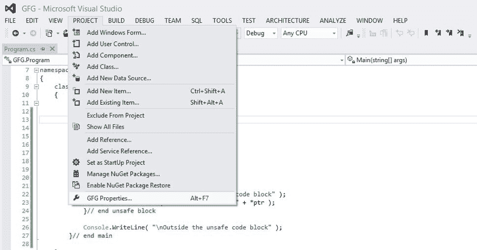
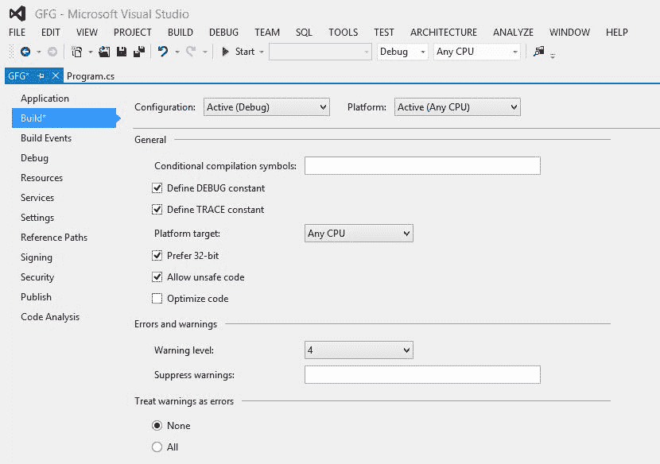
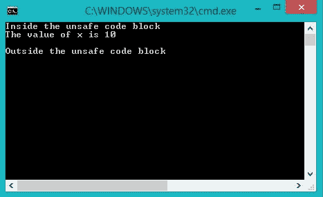

# c# 中的不安全代码

> 原文:[https://www.geeksforgeeks.org/unsafe-code-in-c-sharp/](https://www.geeksforgeeks.org/unsafe-code-in-c-sharp/)

C# 中的不安全代码是在[的](https://www.geeksforgeeks.org/c-sharp-net-framework-basic-architecture-component-stack/)[公共语言运行时(CLR)](https://www.geeksforgeeks.org/common-language-runtime-clr-in-c-sharp/) 控制之外运行的程序部分。NET 框架。CLR 负责程序员不用担心的所有后台任务，比如内存分配和释放、管理栈等。使用关键字“unsafe”意味着告诉编译器，这段代码的管理将由程序员来完成。使代码内容不安全会带来稳定性和安全风险，因为在数组的情况下没有绑定检查，可能会出现与内存相关的错误，这些错误可能会保持未检查状态。

程序员可以将以下子程序视为不安全的:

1.  代码块
2.  方法
3.  类型
4.  班级
5.  结构体

**需要使用不安全代码吗？**

*   当程序需要实现指针时。
*   如果使用本机方法。

**语法:**

```cs
unsafe Context_declaration
```

**示例:**这里，我们将 main 内部的一个代码块声明为不安全，这样我们就可以使用指针。

```cs
// C# program to demonstrate the unsafe code
using System;

namespace GFG {

class Program {

    // Main Method
    static void Main(string[] args)
    {
        // Declaring a code block as 
        // unsafe to make use of pointers
        unsafe
        {
            int x = 10;
            int* ptr;
            ptr = &x;

            // displaying value of x using pointer
            Console.WriteLine("Inside the unsafe code block");
            Console.WriteLine("The value of x is " + *ptr);
        } // end unsafe block

        Console.WriteLine("\nOutside the unsafe code block");
    } // end main
}
}
```

**注意:**该代码不会直接编译，给出如下错误。


因此，如果您使用的是 Visual Studio，则需要遵循给定的步骤:

1)转到项目属性



2)选择构建选项，勾选“*允许不安全代码*”选项。



**输出:**

