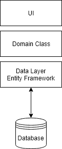
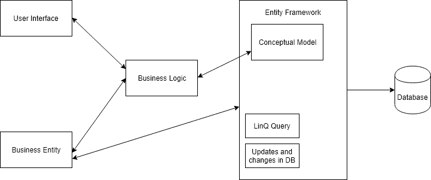

# 什么是实体框架。NET 框架？

> 原文:[https://www . geesforgeks . org/什么是网络框架中的实体框架/](https://www.geeksforgeeks.org/what-is-entity-framework-in-net-framework/)

实体框架是[的开源对象关系映射器框架。NET](https://www.geeksforgeeks.org/introduction-to-net-framework/) 微软支持的应用。它提高了开发人员的工作效率，因为它使开发人员能够使用特定于域的类的对象来处理数据，而不用关注存储这些数据的底层数据库表和列。它消除了开发人员通常需要编写的用于与数据库交互的大部分数据访问代码。它为开发人员使用特定于域的对象来处理关系表和列提供了一个抽象层次。它还减少了数据特定应用程序的代码大小，并且通过使用它提高了代码的可读性。这是一种为微软应用程序访问数据的新技术。实体框架的最新版本是 6.0。

下图描述了实体框架在应用程序中的位置。

上图展示了实体框架如何与域类和数据库交互。它提供了业务实体和数据库中数据表之间的连接。它保存存储在业务实体属性中的数据，还从数据库中检索数据，并自动将其转换为业务实体对象。实体框架将在数据库中执行相关的查询，然后将结果具体化为您的域对象的实例，以便您在应用程序中工作。

### 概念模型

当首先定义实体框架的类和特征，然后实体框架首先将其转换为概念模型，并从概念模型创建数据库和数据库中的对象时，这种方法称为代码优先。现在，您的对象直接与数据库一起检索或进行更改。

### 实体框架的特征

*   它与平台无关。
*   它使用 LinQ 查询而不是 SQL 查询来操作数据库中的数据。
*   它跟踪实体属性中已更改的值。
*   它还保存插入、删除或更新操作所做的更改。
*   它还处理并发性，因此数据被用户覆盖，并将在另一个用户获取它时反映出来。
*   它还自动处理事务管理，并为事务管理提供定制选项。
*   它提供缓存，这意味着它存储经常使用的查询结果。
*   它还遵循某些编程惯例，因此默认情况下配置 EF 模型。
*   它还允许通过流畅的应用编程接口配置英孚模型，以覆盖默认约定。
*   如果您对数据库模式进行了任何更改，那么您可以通过在命令行界面中编写迁移命令来反映 EF 模型中的这些更改。
*   它还支持存储过程。
*   它还支持参数化查询。

**参考:**T2】https://docs.microsoft.com/en-in/ef/ef6/