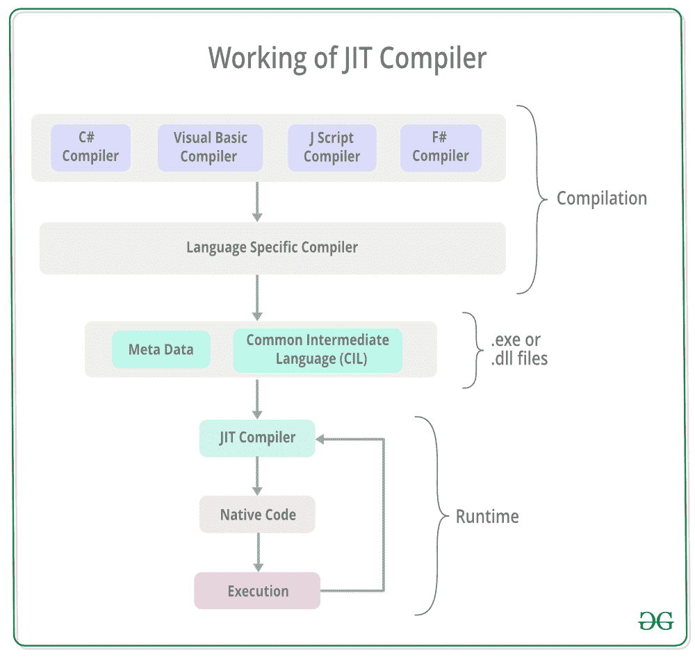
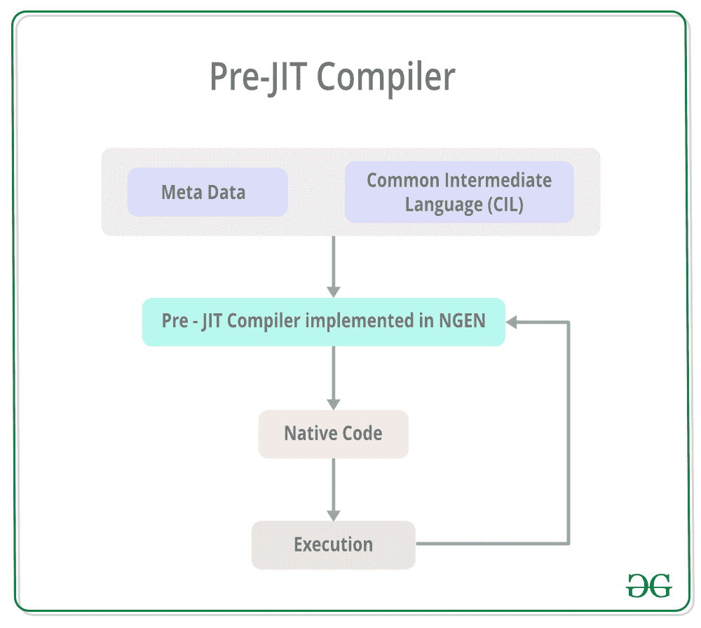
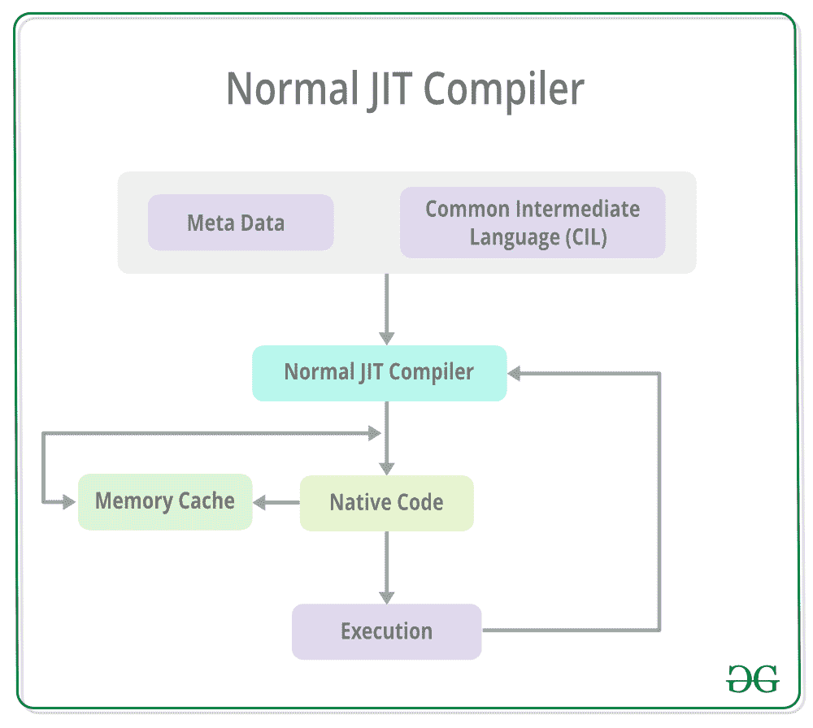
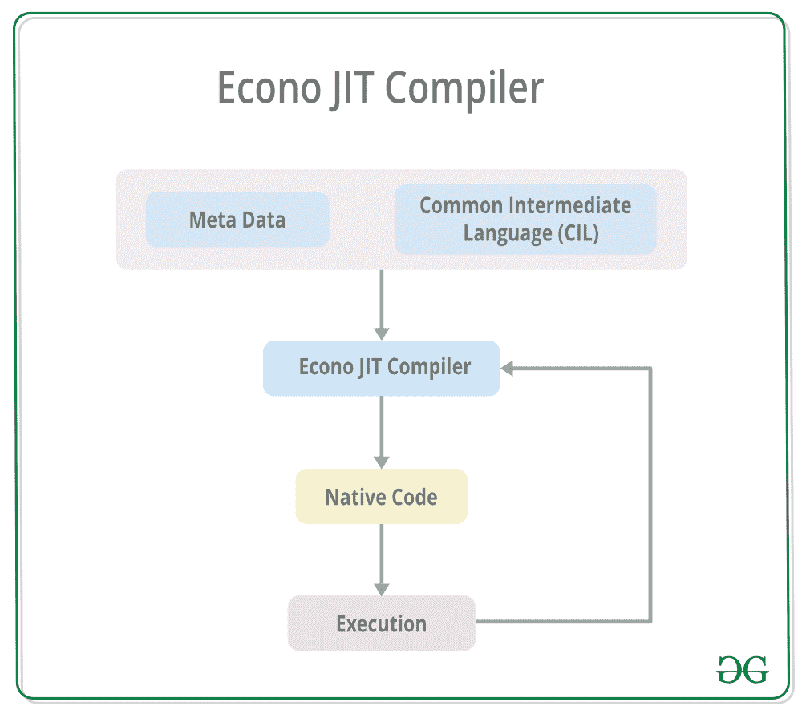

# 什么是准时制编译器。NET

> 原文:[https://www . geeksforgeeks . org/什么是准时制 jit 编译器网络版/](https://www.geeksforgeeks.org/what-is-just-in-time-jit-compiler-in-dot-net/)

准时制编译器是 T4 公共语言运行时的一部分。NET ，负责管理*的执行。NET* 程序，不考虑任何*。NET* 编程语言。特定于语言的编译器将源代码转换为中间语言。这种中间语言然后被实时编译器转换成机器代码。这种机器代码特定于运行 JIT 编译器的计算机环境。

**JIT 编译器的工作方式:**要求 JIT 编译器加快代码执行速度，提供多平台支持。其工作原理如下:

JIT 编译器将微软中间语言(MSIL)或通用中间语言(CIL)转换成机器代码。这是在 MSIL 或 CIL 被处决之前完成的。MSIL 在需求的基础上被转换成机器代码，即 JIT 编译器根据需要编译 MSIL 或 CIL，而不是全部编译。存储已编译的 MSIL 或 CIL，以便在需要时可用于后续调用。

**准时制编译器的类型:**有 **3** 种 JIT 编译器，如下所示:

*   **预 JIT 编译器:**使用预 JIT 编译器，在单个编译周期内，所有源代码同时编译成机器代码。此编译过程在应用程序部署时执行。并且这个编译器总是在***【Ngen.exe】***中实现。

*   **Normal JIT 编译器:**运行时需要的源代码方法，在第一次被 Normal JIT 编译器调用时就被编译成了机器码。此后，它们存储在缓存中，并在再次调用时使用。

*   **Econo JIT 编译器:**运行时所需的源代码方法由 Econo JIT 编译器编译成机器代码。不再需要这些方法后，它们将被删除。这个 JIT 编译器从 dotnet 2.0 开始就过时了

**JIT 编译器的优势:**

*   JIT 编译器需要较少的内存使用，因为只有运行时需要的方法才被 JIT 编译器编译成机器代码。
*   使用 JIT 编译器可以减少页面错误，因为所需的方法很可能在同一个内存页面中。
*   基于统计分析的代码优化可以在代码运行时由 JIT 编译器执行。

**JIT 编译器的缺点:**

*   在应用程序最初执行时，JIT 编译器需要更多的启动时间。
*   JIT 编译器大量使用缓存来存储运行时所需的源代码方法。

**注意:**JIT 编译器的很多缺点都可以通过提前(AOT)编译来解决。这包括将 MSIL 编译成机器代码，这样就不需要运行时编译，并且机器代码文件可以本地执行。