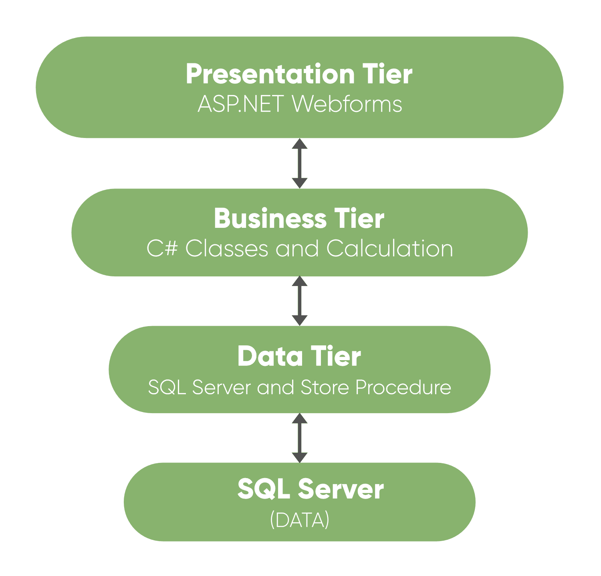

# 是什么。NET 三层架构？

> 原文:[https://www . geesforgeks . org/what-is-net-3 层架构/](https://www.geeksforgeeks.org/what-is-net-3-tier-architecture/)

三层架构将项目分为三层，分别是*用户界面层*、*业务层*和数据(数据库)层，我们将 UI、逻辑和数据分为三个部分。假设用户想要将 UI 从窗口更改为手机，那么他只需要在 UI 层进行更改，其他层不受此更改的影响。类似地，如果用户想要更改数据库，那么他只需在数据层进行更改，其余一切保持不变。

**为什么要在项目中使用三层架构？**

我们使用三层架构来管理大型项目。我们可以举一个例子:假设您已经创建了 2000 个实体代码，并且只在一层中编码了所有代码。现在假设您想从 windows 应用程序更改为移动或 web 应用程序，那么您必须为所有 2000 个实体编写代码，或者您想更改数据库提供程序，那么您必须再次更改所有 2000 个实体中的数据库连接。因此，编写如此大量的代码是浪费时间和金钱。此外，在一个层中编写大量代码只会让新人难以理解这些代码。
所以，为了在不影响其他部分的情况下提供维护性、灵活性、更新灵活性，干净易懂的代码，我们应该在项目中使用三层架构。这个架构基本包含**三层**:

### 1.表示层

这是建筑的顶层。应用程序的最高层是用户界面。它与用户所看到的用户界面有关。该层的主要功能是将任务和结果翻译成用户能够理解的内容。它包含像 web 表单、windows 表单这样的页面，在这些页面中，数据呈现给用户，并用于从用户那里获取输入。表示层是最重要的一层，因为它是用户看到的一层，好的 UI 吸引用户，这个层要设计好。

### 2.业务层

这是建筑的中间层。这一层涉及 C#类，逻辑计算和操作在这一层下执行。它处理命令，做出逻辑决策并执行计算。它还充当两个被包围的层之间的中间件，这两个层是表示层和数据层。它处理这两层之间的数据。这一层实现业务逻辑和计算。该层还在从数据层调用方法之前验证输入条件。这可以确保数据输入在继续之前是正确的，并且通常可以确保输出也是正确的。这种输入验证被称为业务规则。

### 3.数据层

该层用于将业务层连接到数据库或数据源。它包含用于对数据库执行插入、删除、更新等操作的方法。该层包含用于查询数据库的存储过程。因此，该层与数据库建立连接，并在数据库上执行功能。

**优势:**

*   更新到新的图形环境更容易和更快。
*   易于维护的大型复杂项目。
*   它提供了表示层、业务层和数据层之间的逻辑分离。
*   通过在数据层和表示层之间引入应用层，它为数据库层提供了更多的安全性，因此数据将更加安全。
*   您可以在表示层的业务层隐藏不必要的方法。
*   数据提供者查询可以很容易地更新，面向对象的概念可以很容易地应用于项目。

**缺点:**

*   它比简单的客户机-服务器架构更复杂。
*   它很难构建，也很耗时。
*   用户应该对面向对象的概念有很好的了解。