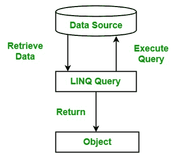

# 什么是 LINQ 查询？

> 原文:[https://www.geeksforgeeks.org/what-is-query-in-linq/](https://www.geeksforgeeks.org/what-is-query-in-linq/)

查询是用于从数据源恢复数据的表达式。一般来说，查询是用某种专门的语言来表达的。开发了不同类型的语言来访问不同类型的数据源，如关系数据库的 SQL、XML 的 XQuery 等。因此，每当开发人员需要为不同类型的数据源学习不同类型的语言时，这种情况会导致开发人员开发一种语言，通过这种语言，他们可以在单一语言的帮助下访问任何类型的数据源。
LINQ 查询满足了这个要求，使用 LINQ 查询可以访问任何类型的数据源，如 XML 文档、SQL 数据库、ADO.NET 数据集等。由 LINQ 供应商提供。在 LINQ 查询中，查询总是将结果作为对象返回，这允许您对结果使用面向对象的方法，而不用担心将不同的数据格式转换成对象。



**例:**

## C#

```
// C# program to demonstrate the 
// Simple query example
using System;
using System.Linq;

class GFG {

    // Main Method
    static public void Main()
    {

        // Creating data source
        string[] language = {"C#", "VB", "Java", "C++", 
                        "C", "Perl", "Ruby", "Python"};

        // Creating a query to get the 
        // value from the data source
        var result = from lang in language
                     where lang.Contains('C')
                     select lang;

        // display the result of the query
        foreach(var l in result)
        {
            Console.WriteLine(l);
        }
    }
}
```

**输出:**

```
C#
C++
C
```

在上例中，LINQ 查询包含 ***三个不同的动作*** :

1.  **Get data source:** In the above example, the data source is an array.

    ```
    string[]language = {"C#", "VB", "Java", "C++", "C", "Perl", "Ruby", "Python"};
    ```

    其中隐式支持泛型 IEnumerable <t>接口。在 LINQ 查询中，一个基本规则是任何对象的数据源都必须支持 IEnumerable <t>接口或继承自 IEnumerable <t>接口的接口。</t></t></t>

2.  **Create Query:** Now the next step is to create a query. With the help of the query, you can get the information from the data source. The query is stored in the query variable and which is initialized with the query expression. The query expression contains the operation that you want to perform on the data source, generally, query expression contains three clauses, i.e, from, where, and select. The from clause is used to specify the data source, where clause applies the filter and select clause provides the type of the returned items. 
    **Example:**

    ```
    var result = from lang in language
                        where lang.Contains('C')
                        select lang;
    ```

    这里产生了用查询表达式初始化的查询变量。
    **注意:**查询变量本身不执行任何操作。它仅用于存储查询表达式的结果，并在查询执行时使用。

3.  **执行查询:**查询变量存储查询表达式的结果。但是，当您使用 foreach 循环迭代查询变量以显示查询结果时，就会执行查询。当您使用 foreach 循环执行查询时，它被称为*延迟执行*。在上面的例子中，我们使用了延迟执行。

    ```
    foreach(var l in result){

            Console.WriteLine(l);
        }
    ```