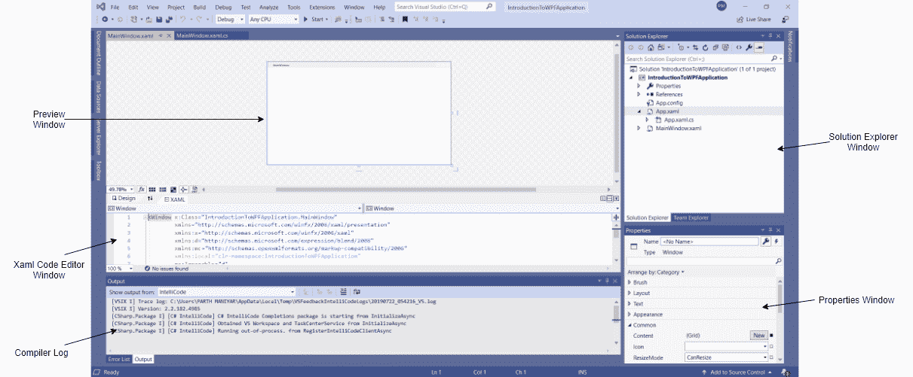

# 什么是 WPF？

> 原文:[https://www.geeksforgeeks.org/what-is-wpf/](https://www.geeksforgeeks.org/what-is-wpf/)

视窗演示基金会(WPF)是一个用于创建桌面应用程序的开发框架。它是[的一部分。NET 框架](https://www.geeksforgeeks.org/introduction-to-net-framework/)。WPF 有一个独立于分辨率和基于矢量的渲染引擎，有助于处理现代图形硬件。WPF 的最新版本是 *4.6* 。在这个框架中，应用程序的用户界面用 XAML 语言设计，应用程序逻辑用 [C#](https://www.geeksforgeeks.org/introduction-to-c-sharp/) 编程语言编写。

***WPF 的特点如下:***

*   可扩展应用标记语言(XAML)
*   控制
*   数据绑定
*   布局
*   2D 和 3D 图形
*   动画
*   风格
*   模板
*   文档
*   媒体
*   文本
*   排印

**WPF 架构:**WPF 的主要组件是 PresentationFramework、PresentationCore、Milcore、[公共语言运行时(CLR)](https://www.geeksforgeeks.org/common-language-runtime-clr-in-c-sharp/) 、User32、Kernel。Milcore 是用非托管代码编写的，以便与负责显示的 DirectX 紧密集成。WPF 对记忆和执行有很好的控制。milcore 中的合成引擎对性能极其敏感，需要放弃公共语言运行库的许多优势才能获得性能。

### 使用 Visual Studio 2019 创建 WPF 应用程序

**第一步:**打开 Visual Studio，在**开始**菜单下选择**新建项目**。将打开“创建新项目”对话框。选择 **WPF 应用程序(。NET Framework)** 模板，然后选择**下一步**。

**步骤 2:****配置新项目**对话框打开。输入项目名称 **<mark>简介</mark>** ，然后选择**创建**。

Visual Studio 创建项目并打开名为 **MainWindow.xaml** 的默认应用程序窗口的设计器。

*   **解决方案资源管理器窗口:**用于在 Project 中的所有文件之间导航。例如，如果您将从此窗口中选择一个文件，那么与此文件相关的所有属性都将出现在属性窗口中。
*   **属性窗口:**该窗口用于在解决方案资源管理器中更改所选项目的不同属性。此外，您可以更改将添加到应用程序的组件或控件的属性。
*   **编译器日志:**该窗口显示错误和警告消息。
*   **Xaml 代码编辑器:**在这个窗口中，我们可以为 App 的 UI 编写 Xaml 代码。
*   **Preview Window:** We can see the preview of the window how the window will look like.

    您也可以通过将其设置为默认值来重置窗口布局。要设置默认布局，请转到 Visual Studio 菜单中的**窗口- >重置窗口布局**。

    **步骤 3:** 现在要将控件添加到您的 WPF 应用程序中，请转到 Visual Studio 最左侧的工具箱选项卡。在这里，您可以看到控件列表。要访问最常用的控件，请转到“工具箱”选项卡中的“常用控件”。

    

    **第 4 步:**现在拖放您在创建的表单上需要的控件。例如，如果可以添加文本框、列表框、按钮等。如下所示。通过单击预览窗口中的特定控件，您可以看到并更改 Visual Studio 最右边的属性。

    

    在上图中，您可以看到文本框被选中，其属性在最右边的角落打开。您可以根据应用程序的需要更改其属性值。控件的代码将自动添加到 XAML 代码编辑器中。

    **步骤 5:** 要运行程序，可以使用 Visual Studio 工具栏中的 F5 键或播放按钮。要停止程序，您可以使用工具栏中的暂停按钮。也可以通过菜单栏中的调试- >开始调试菜单来运行程序。

    

    如果您以前使用过 Windows 窗体，那么使用 WPF 将非常容易。

    **WPF 的优势:**

    *   它使用当前标准，因为它较新
    *   控件的开发人员可能会更关注 WPF，因为它的 XAML 使创建和编辑用户界面变得容易，并允许开发工作在设计师(XAML)和程序员(C#)之间分开。
    *   数据绑定用于在数据和布局之间建立清晰的分隔。
    *   高效使用硬件绘制用户界面，以获得更好的性能。
    *   它用于为 Windows 应用程序和 web 应用程序制作用户界面。