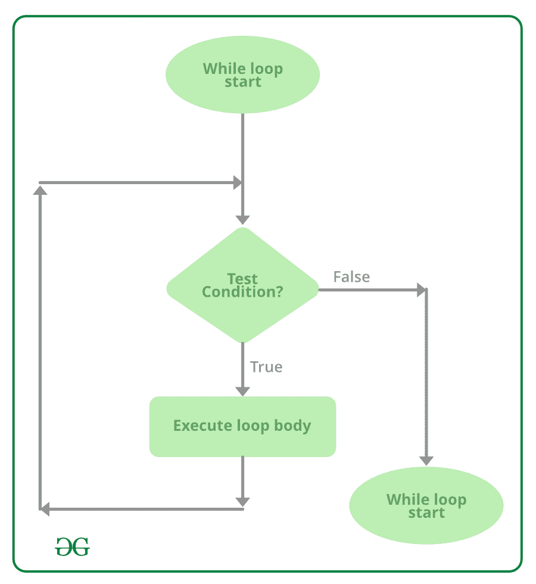

# 在 C# 中循环时

> 原文:[https://www.geeksforgeeks.org/while-loop-in-c-sharp/](https://www.geeksforgeeks.org/while-loop-in-c-sharp/)

在编程语言中，循环是一种根据要评估的条件的结果多次执行一条语句或一组语句的方法。而循环是 [C# ](https://www.geeksforgeeks.org/introduction-to-c-sharp/) 中的**入口控制循环**。

测试条件在循环开始时给出，所有语句一直执行到给定的布尔条件满足，当条件变为假时，控件将从 while 循环中退出。

**语法:**

```cs
while (boolean condition)
{
   loop statements...
}

```

**流程图:**



**例 1:**

```cs
// C# program to illustrate while loop
using System;

class whileLoopDemo {
    public static void Main()
    {
        int x = 1;

        // Exit when x becomes greater than 4
        while (x <= 4) {
            Console.WriteLine("GeeksforGeeks");

            // Increment the value of x for
            // next iteration
            x++;
        }
    }
}
```

**Output:**

```cs
GeeksforGeeks
GeeksforGeeks
GeeksforGeeks
GeeksforGeeks

```

**例 2:**

```cs
// C# program to illustrate while loop
using System;

class whileLoopDemo {
    public static void Main()
    {
        int x = 10;

        // Exit when x becomes less than 5
        while (x > 4) {
            Console.WriteLine("Value " + x);

            // Decrement the value of x for
            // next iteration
            x--;
        }
    }
}
```

**Output:**

```cs
Value 10
Value 9
Value 8
Value 7
Value 6
Value 5

```